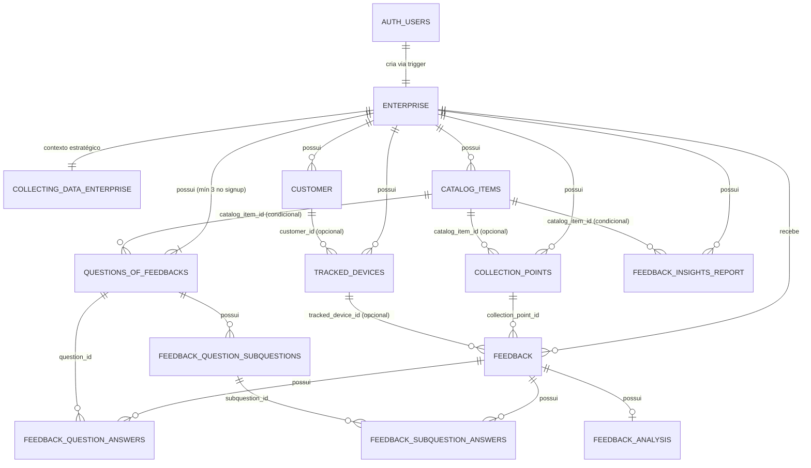

# Diagrama de Entidade e Relacionamento (DER)

> Guia conceitual das entidades do banco de dados, seus campos principais e como se relacionam. Para a referência técnica completa (RLS, índices, triggers, funções), consulte [Visão Geral do Banco de Dados](../referencia/banco-de-dados/visao-geral.md).

---

## Mapa de Relacionamentos

> **Legenda de cardinalidade:** `||` = exatamente 1 · `o|` = 0 ou 1 (opcional) · `|{` = 1 ou muitos · `o{` = 0 ou muitos.

**Visualizar o código no site: https://mermaid.ai/** 

> Todas as tabelas possuem `enterprise_id` FK obrigatória (isolamento RLS multi-tenant), **exceto**: `feedback_question_subquestions`, `feedback_question_answers`, `feedback_subquestion_answers` e `feedback_analysis` — isolamento herdado via cascade da tabela pai.

> **View `enterprise_public` (não é entidade física, por isso fora do `erDiagram`):** expõe apenas `id` e `name`, onde `name` deriva de `auth.users.raw_user_meta_data ->> 'full_name'` (a tabela `enterprise` não tem coluna `name`). Existe para o fluxo anônimo de coleta — o formulário público (QR Code) lê o nome da empresa sem login, via papel `anon`. Roda com os privilégios do OWNER (`security_invoker = off`), intencional e necessário, pois `anon` não tem policy de SELECT em `enterprise` nem acesso a `auth.users`.

---

## Grupos de Entidades

### 1. Identidade e Empresa

#### `auth.users` (schema `auth` — Supabase)
Gerenciado pelo Supabase Auth. Registra o login do empresário.

| Campo | Tipo | Descrição |
|---|---|---|
| `id` | uuid | Chave primária |
| `email` | text | E-mail de login |
| `phone` | text | Telefone (promovido do metadata no signup) |
| `raw_user_meta_data` | jsonb | Metadados temporários usados no signup (document, account_type, etc.) |

> O trigger `on_auth_user_created` dispara ao criar o usuário e automaticamente cria a `enterprise` com `trial_ends_at = NOW() + 4 months` e `subscription_status = 'TRIAL'`, semeia as 3 perguntas padrão (COMPANY) e limpa os metadados sensíveis do JWT.

---

#### `enterprise`
Empresa vinculada ao usuário autenticado. Âncora de todo o isolamento multi-tenant.

| Campo | Tipo | Descrição |
|---|---|---|
| `id` | uuid | Chave primária |
| `auth_user_id` | uuid | FK → `auth.users.id` (1:1) |
| `document` | text | CPF ou CNPJ |
| `account_type` | text | `CPF` ou `CNPJ` |
| `terms_version` | text | Versão dos termos aceitos |
| `terms_accepted_at` | timestamptz | Data de aceite dos termos |
| `trial_ends_at` | timestamptz | Data de expiração do período de teste (NOW() + 4 meses no signup) |
| `subscription_status` | text | `TRIAL` \| `ACTIVE` \| `EXPIRED` \| `CANCELED` (default `TRIAL`) |

---

#### `collecting_data_enterprise`
Contexto estratégico da empresa usado como entrada para a análise da IA. Relação 1:1 com `enterprise`.

| Campo | Tipo | Descrição |
|---|---|---|
| `id` | uuid | Chave primária |
| `enterprise_id` | uuid | FK → `enterprise.id` |
| `company_objective` | text | Objetivo central da empresa |
| `analytics_goal` | text | O que a empresa quer descobrir com os feedbacks |
| `business_summary` | text | Resumo do negócio |
| `main_products_or_services` | text[] | Lista dos principais produtos/serviços |
| `uses_company_products` | bool | Habilita escopo Produtos |
| `uses_company_services` | bool | Habilita escopo Serviços |
| `uses_company_departments` | bool | Habilita escopo Departamentos |

---

### 2. Catálogo e Pontos de Coleta

#### `catalog_items`
Produtos, serviços ou departamentos que a empresa quer avaliar individualmente. Cada item pode ter seu próprio QR Code, perguntas e relatório de insights.

| Campo | Tipo | Descrição |
|---|---|---|
| `id` | uuid | Chave primária |
| `enterprise_id` | uuid | FK → `enterprise.id` |
| `kind` | text | `PRODUCT`, `SERVICE` ou `DEPARTMENT` |
| `name` | text | Nome do item |
| `description` | text | Descrição opcional |
| `status` | text | `ACTIVE` ou `INACTIVE` |
| `sort_order` | int | Ordem de exibição |

---

#### `collection_points`
Pontos de coleta de feedback — atualmente sempre do tipo QR Code. Podem estar vinculados à empresa em geral (escopo COMPANY) ou a um item específico do catálogo.

| Campo | Tipo | Descrição |
|---|---|---|
| `id` | uuid | Chave primária |
| `enterprise_id` | uuid | FK → `enterprise.id` |
| `catalog_item_id` | uuid | FK → `catalog_items.id` (opcional — nulo = escopo COMPANY) |
| `name` | text | Nome do ponto de coleta |
| `type` | text | `QR_CODE` (único tipo suportado atualmente) |
| `identifier` | text | Identificador único do QR Code |
| `status` | text | `ACTIVE` ou `INACTIVE` |

---

### 3. Rastreamento e Identificação

#### `tracked_devices`
Rastreia cada dispositivo que acessa o formulário público via fingerprint diário (MD5 de user-agent + IP + data). Controla limites de envio e bloqueio de spam.

| Campo | Tipo | Descrição |
|---|---|---|
| `id` | uuid | Chave primária |
| `enterprise_id` | uuid | FK → `enterprise.id` |
| `customer_id` | uuid | FK → `customer.id` (opcional — só preenchido se o cliente se identificar) |
| `device_fingerprint` | text | Hash MD5 diário (user-agent + IP + data) |
| `user_agent` | text | User-agent do navegador |
| `ip_address` | inet | IP de origem |
| `feedback_count` | int | Total de feedbacks enviados por este dispositivo |
| `last_feedback_at` | timestamptz | Data do último envio |
| `is_blocked` | bool | `true` = dispositivo bloqueado permanentemente |
| `blocked_reason` | text | Motivo do bloqueio |

> O fingerprint expira a cada 24h (data compõe o hash), então um dispositivo legítimo que retorna no dia seguinte recebe um novo `tracked_device`.

---

#### `customer`
Dados básicos do cliente final, preenchidos **somente se ele optar por se identificar** no formulário. O anonimato é o padrão.

| Campo | Tipo | Descrição |
|---|---|---|
| `id` | uuid | Chave primária |
| `enterprise_id` | uuid | FK → `enterprise.id` |
| `name` | text | Nome (opcional) |
| `email` | text | E-mail (opcional) |
| `gender` | text | Gênero (opcional) |

---

### 4. Estrutura da Pesquisa

#### `questions_of_feedbacks`
Perguntas dinâmicas exibidas no formulário. Podem ter escopo da empresa inteira (`COMPANY`) ou de um item específico do catálogo (`PRODUCT`, `SERVICE` ou `DEPARTMENT`). **3 perguntas COMPANY são criadas automaticamente no signup** e servem como base enquanto a empresa não personaliza.

| Campo | Tipo | Descrição |
|---|---|---|
| `id` | uuid | Chave primária |
| `enterprise_id` | uuid | FK → `enterprise.id` |
| `scope_type` | text | `COMPANY`, `PRODUCT`, `SERVICE` ou `DEPARTMENT` |
| `catalog_item_id` | uuid | FK → `catalog_items.id` (nulo quando `scope_type = COMPANY`) |
| `question_order` | int | Posição da pergunta (1, 2 ou 3) |
| `question_text` | text | Texto da pergunta |
| `is_active` | bool | Controla se a pergunta aparece no formulário |

---

#### `feedback_question_subquestions`
Sub-perguntas vinculadas a uma pergunta principal para maior detalhamento. Cada pergunta suporta até 3 sub-perguntas.

| Campo | Tipo | Descrição |
|---|---|---|
| `id` | uuid | Chave primária |
| `question_id` | uuid | FK → `questions_of_feedbacks.id` |
| `subquestion_order` | int | Posição (1, 2 ou 3) |
| `subquestion_text` | text | Texto da sub-pergunta (20–150 chars) |
| `is_active` | bool | Controla visibilidade no formulário |

---

### 5. Captação de Dados (O Feedback)

#### `feedback`
Registro central da avaliação enviada pelo cliente. Agrega todos os dados de uma submissão: quem enviou, de onde, a mensagem e a nota geral.

| Campo | Tipo | Descrição |
|---|---|---|
| `id` | uuid | Chave primária |
| `enterprise_id` | uuid | FK → `enterprise.id` |
| `collection_point_id` | uuid | FK → `collection_points.id` |
| `tracked_device_id` | uuid | FK → `tracked_devices.id` (opcional) |
| `message` | text | Comentário livre do cliente |
| `rating` | int | Nota geral (1–5 estrelas) |

---

#### `feedback_question_answers`
Resposta do cliente para cada pergunta dinâmica. Armazena um **snapshot do texto da pergunta** no momento da submissão, garantindo que alterações futuras na pergunta não corrompam o histórico.

| Campo | Tipo | Descrição |
|---|---|---|
| `id` | uuid | Chave primária |
| `feedback_id` | uuid | FK → `feedback.id` |
| `question_id` | uuid | FK → `questions_of_feedbacks.id` |
| `question_text_snapshot` | text | Texto da pergunta no momento da resposta |
| `answer_value` | text | `PESSIMO`, `RUIM`, `MEDIANA`, `BOA` ou `OTIMA` |
| `answer_score` | int | Score numérico (1–5) correspondente ao `answer_value` |

---

#### `feedback_subquestion_answers`
Resposta do cliente para cada sub-pergunta. Mesmo mecanismo de snapshot de `feedback_question_answers`.

| Campo | Tipo | Descrição |
|---|---|---|
| `id` | uuid | Chave primária |
| `feedback_id` | uuid | FK → `feedback.id` |
| `subquestion_id` | uuid | FK → `feedback_question_subquestions.id` |
| `subquestion_text_snapshot` | text | Texto da sub-pergunta no momento da resposta |
| `answer_value` | text | `PESSIMO`, `RUIM`, `MEDIANA`, `BOA` ou `OTIMA` |
| `answer_score` | int | Score numérico (1–5) |

---

### 6. Processamento por Inteligência Artificial

#### `feedback_analysis`
Análise individual gerada pela IA para um feedback específico. Relação 1:1 com `feedback`.

| Campo | Tipo | Descrição |
|---|---|---|
| `id` | uuid | Chave primária |
| `feedback_id` | uuid | FK → `feedback.id` (único) |
| `sentiment` | text | Sentimento extraído pela IA |
| `categories` | text[] | Categorias temáticas identificadas |
| `keywords` | text[] | Palavras-chave relevantes extraídas |
| `aspects` | jsonb | Sentimento por aspecto (ABSA) extraído do texto |
| `sentiment_score` | numeric | Intensidade graduada do sentimento geral em `[-1, 1]` |
| `confidence` | numeric | Confiança da classificação em `[0, 1]` |

---

#### `feedback_insights_report`
Relatório consolidado gerado pela IA sobre um conjunto de feedbacks. Pode cobrir a empresa inteira (`COMPANY`) ou um item específico do catálogo. É regenerável — um novo relatório sobrescreve o anterior para o mesmo escopo.

| Campo | Tipo | Descrição |
|---|---|---|
| `id` | uuid | Chave primária |
| `enterprise_id` | uuid | FK → `enterprise.id` |
| `scope_type` | text | `COMPANY`, `PRODUCT`, `SERVICE` ou `DEPARTMENT` |
| `catalog_item_id` | uuid | FK → `catalog_items.id` (nulo quando `scope_type = COMPANY`) |
| `catalog_item_name` | text | Snapshot do nome do item no momento da geração |
| `summary` | text | Resumo executivo gerado pela IA |
| `recommendations` | text[] | Lista de recomendações práticas |

---

## Enumerações

| Enum | Valores |
|---|---|
| `catalog_items.kind` | `PRODUCT`, `SERVICE`, `DEPARTMENT` |
| `catalog_items.status` | `ACTIVE`, `INACTIVE` |
| `collection_points.type` | `QR_CODE` |
| `collection_points.status` | `ACTIVE`, `INACTIVE` |
| `questions_of_feedbacks.scope_type` | `COMPANY`, `PRODUCT`, `SERVICE`, `DEPARTMENT` |
| `feedback_insights_report.scope_type` | `COMPANY`, `PRODUCT`, `SERVICE`, `DEPARTMENT` |
| `enterprise.account_type` | `CPF`, `CNPJ` |
| `enterprise.subscription_status` | `TRIAL`, `ACTIVE`, `EXPIRED`, `CANCELED` |
| `answer_value` (respostas) | `PESSIMO`, `RUIM`, `MEDIANA`, `BOA`, `OTIMA` |

---

## Veja Também

- [Visão Geral do Banco de Dados](../referencia/banco-de-dados/visao-geral.md) — referência técnica completa (RLS, triggers, funções, índices)
