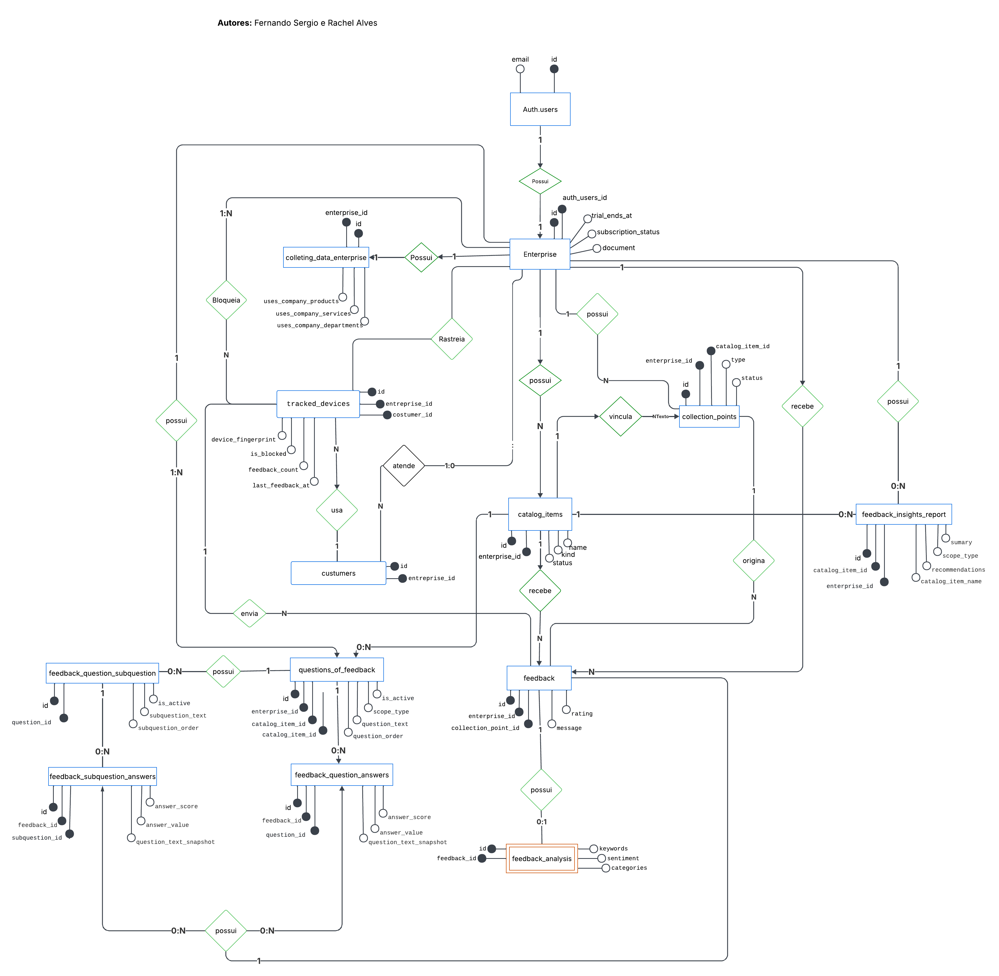

# Modelo Conceitual (MER)

> Modelo de Entidade e Relacionamento **conceitual** (notação de Chen): a visão de alto nível das entidades do domínio e de como elas se relacionam, antes do mapeamento para tabelas.
>
> Para o modelo **lógico** (tabelas, FKs e cardinalidades em crow's-foot) veja a [Modelagem de Dados (DER)](modelagem-de-dados.md); para o detalhe **físico** (colunas, tipos, RLS, índices, triggers e funções) veja a [Visão Geral do Banco de Dados](../referencia/banco-de-dados/visao-geral.md).

---

## Diagrama

<figure markdown="span">
  
  <figcaption>MER — notação de Chen. Autores: Fernando Sergio e Rachel Alves.</figcaption>
</figure>

> **Como ler:** retângulos são **entidades**, losangos são **relacionamentos** e elipses são **atributos** (elipse preenchida = identificador). Os rótulos nas conexões (`1`, `N`, `0:1`, `1:N`) indicam a **cardinalidade** de participação de cada entidade no relacionamento.

---

## Relacionamentos e Cardinalidades

| Entidade A | Card. | Entidade B | Descrição |
| --- | --- | --- | --- |
| `auth.users` | 1 — 1 | `enterprise` | Cada usuário autenticado possui exatamente uma empresa, criada automaticamente no cadastro. |
| `enterprise` | 1 — 1 | `collecting_data_enterprise` | Uma empresa tem exatamente um registro de dados estratégicos. |
| `enterprise` | 1 — N | `catalog_items` | Uma empresa cadastra múltiplos itens de catálogo (produtos, serviços, departamentos). |
| `enterprise` | 1 — N | `collection_points` | Uma empresa possui múltiplos pontos de coleta de feedback. |
| `enterprise` | 1 — N | `customer` | Uma empresa atende múltiplos clientes. |
| `enterprise` | 1 — N | `tracked_devices` | Uma empresa rastreia múltiplos dispositivos. |
| `enterprise` | 1 — N | `feedback` | Uma empresa recebe múltiplos feedbacks. |
| `enterprise` | 1 — N | `questions_of_feedbacks` | Uma empresa define múltiplas perguntas dinâmicas por escopo/contexto. |
| `enterprise` | 1 — N | `feedback_insights_report` | Uma empresa possui múltiplos relatórios de insights (um por escopo/item). |
| `catalog_items` | 0..1 — N | `collection_points` | Um ponto de coleta pode estar vinculado a um item do catálogo (opcional). |
| `catalog_items` | 0..1 — N | `questions_of_feedbacks` | Uma pergunta pode ser contextualizada por um item do catálogo (null = escopo COMPANY). |
| `catalog_items` | 0..1 — N | `feedback_insights_report` | Um relatório pode ser contextualizado por um item do catálogo (null = escopo COMPANY). |
| `collection_points` | 1 — N | `feedback` | Cada ponto de coleta recebe múltiplos feedbacks. |
| `tracked_devices` | 0..1 — N | `feedback` | Um feedback pode estar associado a um dispositivo rastreado (opcional). |
| `customer` | 0..1 — N | `tracked_devices` | Um dispositivo pode ser atribuído a um cliente (opcional). |
| `feedback` | 1 — 0..1 | `feedback_analysis` | Cada feedback gera no máximo uma análise de sentimento/categorias (relação 1:1, `feedback_id` único). |
| `feedback` | 1 — N | `feedback_question_answers` | Cada feedback armazena respostas para as perguntas dinâmicas do formulário. |
| `feedback` | 1 — N | `feedback_subquestion_answers` | Cada feedback armazena respostas para as subperguntas ativas. |
| `questions_of_feedbacks` | 1 — N | `feedback_question_subquestions` | Cada pergunta pode ter até 3 subperguntas de detalhamento. |
| `questions_of_feedbacks` | 1 — N | `feedback_question_answers` | Cada pergunta pode receber múltiplas respostas (uma por feedback). |
| `feedback_question_subquestions` | 1 — N | `feedback_subquestion_answers` | Cada subpergunta pode receber múltiplas respostas (uma por feedback). |
| `auth.users` (via `blocked_by`) | 0..1 — N | `tracked_devices` | Um dispositivo pode ser bloqueado por um usuário autenticado (opcional). |

> A entidade raiz de autorização é `enterprise`: quase todas as tabelas carregam `enterprise_id` para o isolamento multi-tenant (RLS). As exceções (`feedback_question_subquestions`, `feedback_question_answers`, `feedback_subquestion_answers` e `feedback_analysis`) herdam o isolamento por cascata da entidade-pai.

---

## Veja Também

- [Modelagem de Dados (DER)](modelagem-de-dados.md) — modelo lógico (crow's-foot) com os campos de cada entidade e as enumerações.
- [Visão Geral do Banco de Dados](../referencia/banco-de-dados/visao-geral.md) — referência física completa (colunas, RLS, índices, triggers, funções e a view `enterprise_public`).
