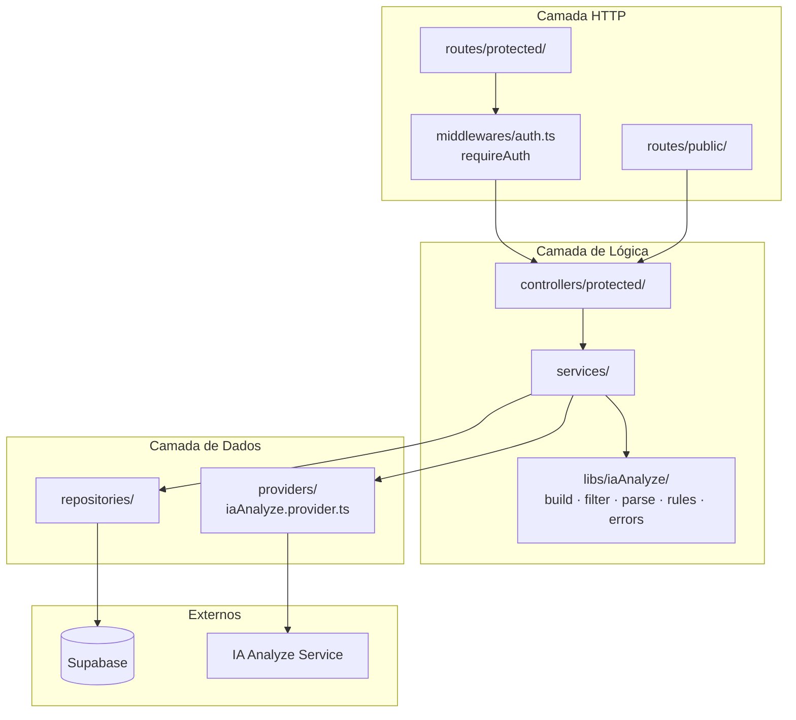
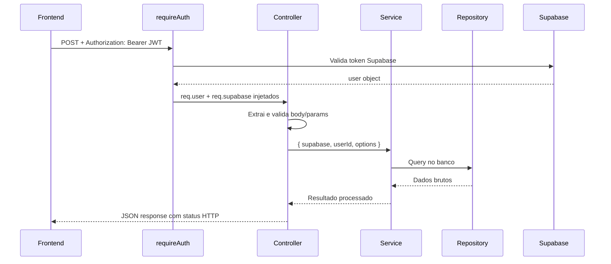
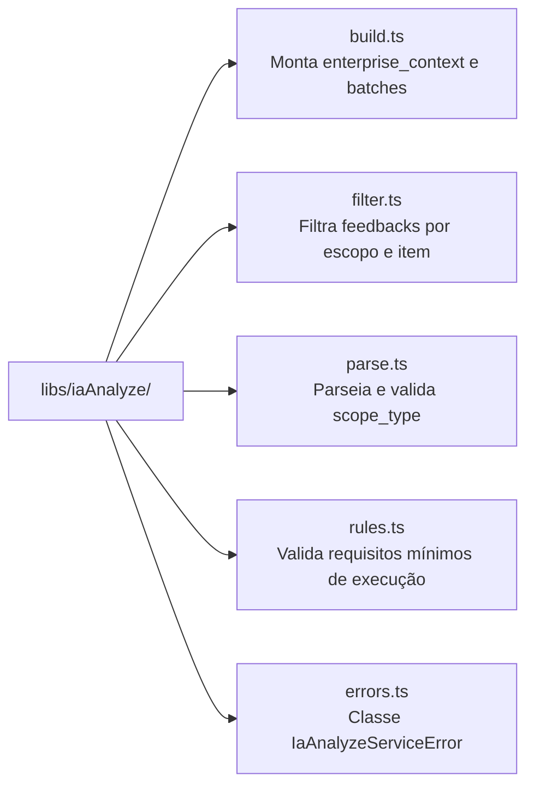

# Backend — Arquitetura e Estrutura (API Gateway)

## Camadas da Aplicação

O API Gateway segue uma arquitetura em camadas com responsabilidades bem definidas. Cada requisição percorre o seguinte caminho:

```
Route → Middleware (auth) → Controller → Service → Repository → Supabase
```

Nenhuma camada pula outra. O controller não acessa o banco diretamente; o repository não tem lógica de negócio.



---

## Fluxo de uma Requisição Protegida



---

## Módulo `libs/iaAnalyze/` — Funções Puras do Domínio IA



Essas funções são **puras e sem efeitos colaterais** — não fazem chamadas a banco ou rede. Isso facilita testes unitários e reutilização.

---

## Estrutura de Diretórios

```
backends/api-gateway/src/
├── config/
│   └── errors.ts
├── controllers/protected/
│   ├── enterprise.controller.ts
│   ├── feedbacks.controller.ts
│   ├── iaAnalyze.controller.ts      → analyze-raw + regenerate-insights
│   ├── collectionPointsQr.controller.ts
│   └── user.controller.ts
├── services/
│   └── iaAnalyze.service.ts         → analyzeRawFeedbacks + regenerateFeedbackInsights
├── repositories/
│   └── iaAnalyze.repository.ts
├── routes/
│   ├── protected/
│   │   ├── enterprise.routes.ts
│   │   ├── feedbacks.routes.ts
│   │   ├── iaAnalyze.routes.ts      → /protected/ia-analyze/*
│   │   ├── collectionPointsQr.routes.ts
│   │   └── user.routes.ts
│   └── public/
│       ├── auth.routes.ts
│       ├── qrcode.routes.ts
│       └── health.routes.ts
├── libs/iaAnalyze/
│   ├── build.ts
│   ├── errors.ts
│   ├── filter.ts
│   ├── parse.ts
│   └── rules.ts
├── middlewares/
│   └── auth.ts
├── providers/
│   └── iaAnalyze.provider.ts
└── utils/
    └── sendTypedError.ts
```

---

## Breaking Changes (homolog → main)

:::warning
Os seguintes arquivos foram **removidos** nesta branch e substituídos pela nova estrutura de camadas:

- `repositories/protected/collectionPointsQr/` — handlers, types e validation
- `repositories/protected/enterprise/handlers.ts` (1066 linhas)
- `repositories/protected/feedbacks/handlers.ts` (832 linhas)
- `repositories/protected/iaAnalyze/handlers.ts`
- `services/iaAnalyze/iaAnalyzeErrors.ts`

Se o seu código importa qualquer um desses módulos, atualize para os caminhos da nova estrutura.
:::
