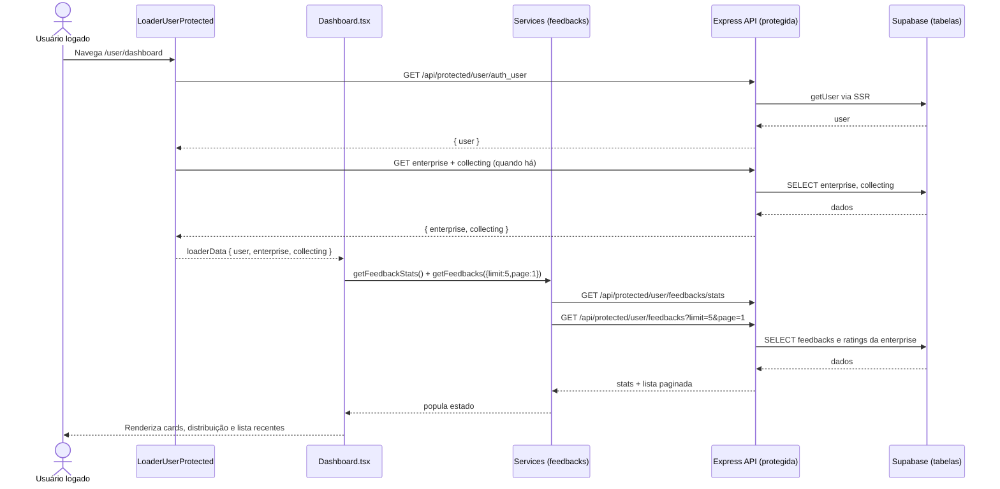

# Fluxo do Dashboard (pages/user/dashboard.tsx)

Este documento descreve o fluxo completo da página de Dashboard: front-end (página e loader protegido), services do cliente, API protegida (Express) e banco (Supabase). Mostra por onde os dados passam, quais arquivos compõem o fluxo e como tudo se conecta.

## Visão geral

- O loader protegido da rota `/user` carrega `user`, `enterprise` e `collecting` antes de renderizar as rotas filhas (incluindo o Dashboard).
- A página `Dashboard` busca, em paralelo, estatísticas de feedback (`getFeedbackStats`) e a lista de últimos feedbacks (`getFeedbacks`).
- Ambos os serviços chamam endpoints PROTEGIDOS da API, que exigem sessão válida (cookies httpOnly geridos no backend via Supabase SSR).
- A API identifica a empresa do usuário logado, consulta o banco e retorna os dados para o front.

## Front-end

### Rota protegida e Loader

- Arquivo: `src/routes/user.tsx`
  - Define o segmento `/user` com `loader={LoaderUserProtected}` e suas rotas filhas (incluindo `dashboard`).
- Arquivo: `src/routes/loaders/loaderUserProtected.ts`
  - Fluxo do loader:
    1. Busca usuário autenticado: `getAuthUser()` → `GET /api/protected/user/auth_user`.
    2. Busca empresa do usuário: `getEnterprise()` (ignora erro se não houver).
    3. Se houver empresa, busca dados de coleta: `getCollectingDataEnterprise()`.
    4. Retorna `{ user, enterprise, collecting }` como `loaderData` (usado com `useRouteLoaderData('user')`).
  - Em erro/sem sessão válida: faz `redirect('/login')`.

### Página do Dashboard

- Arquivo: `pages/user/dashboard.tsx`
  - Lê `loaderData` do segmento `user` (user, enterprise, collecting).
  - Estados locais: `stats`, `latestFeedbacks`, `loading`, `error`.
  - Efeito inicial (`useEffect`): chama em paralelo
    - `getFeedbackStats()` → estatísticas (total, média, distribuição por nota, sentimento)
    - `getFeedbacks({ limit: 5, page: 1 })` → últimos 5 feedbacks
  - Em sucesso, popula os estados; em erro, mostra alerta.
  - Apresenta métricas (cards), distribuição de avaliações e lista dos mais recentes.

### Services do cliente

- Arquivo: `src/services/feedbacks.ts`
  - `getFeedbacks(filters?: FeedbackFilters)`
    - Monta `URLSearchParams` com `page`, `limit`, `rating`, `search`.
    - GET `/api/protected/user/feedbacks?{query}`
    - Retorno: `FeedbacksResponse` (`feedbacks` + `pagination`).
  - `getFeedbackStats()`
    - GET `/api/protected/user/feedbacks/stats`
    - Retorno: `FeedbackStats`.
- Arquivo: `src/services/http.ts`
  - `getJson`/`postJson` usam `credentials: 'include'` e tratam `!res.ok` jogando erro com `status`.

### Tipos utilizados (front)

- Arquivo: `lib/interfaces/user/feedback.ts`
  - `Feedback`, `FeedbacksResponse`, `FeedbackStats`, `FeedbackFilters` etc.

## Backend (Express)

- Middleware de proteção:
  - Arquivo: `src/server/express/middleware/auth.ts` (`requireAuth`)
    - Lê cookies, cria cliente SSR (`createSupabaseServerClient`), chama `supabase.auth.getUser()`.
    - Em sucesso, anexa `req.user` e `req.supabase` e segue; senão, `401 { error: 'unauthorized' }`.

### Lista de feedbacks com paginação

- Arquivo: `src/server/express/routes/endpoints/protected/feedbacks.ts`
- Endpoint: `GET /api/protected/user/feedbacks`
- Passos:
  1. `requireAuth` garante sessão; `supabase = req.supabase`, `user = req.user`.
  2. Busca a empresa do usuário: `from('enterprise').select('id').eq('auth_user_id', user.id).single()`.
  3. Monta query base em `feedback` com relacionamentos:
     - `collection_points!inner(id, name, type, identifier)`
     - `tracked_devices(..., customer(id, name, email, gender))`
     - Filtro: `.eq('enterprise_id', enterprise.id)` e `.order('created_at', { ascending: false })`.
  4. Aplica filtros opcionais: `rating` exato e `search` por `message` (`ilike`).
  5. Calcula contagem total (query separada) para paginação.
  6. Aplica `range(offset, offset+limit-1)` e retorna lista e `pagination` com `totalPages`, `hasNextPage` etc.
  7. Erros mapeados: `404 enterprise_not_found`, `500 failed_to_count_feedbacks/failed_to_fetch_feedbacks/internal_server_error`.

### Estatísticas do dashboard

- Arquivo: `src/server/express/routes/endpoints/protected/feedbacks.ts`
- Endpoint: `GET /api/protected/user/feedbacks/stats`
- Passos:
  1. `requireAuth` valida sessão e obtém `user` e `supabase`.
  2. Busca a empresa: `enterprise` por `auth_user_id`.
  3. Busca `feedback.rating` da empresa.
  4. Calcula em memória:
     - `totalFeedbacks`, `averageRating` (arredondado 1 casa), `ratingDistribution` para 1..5.
     - `sentimentBreakdown`: `positive = 4+5`, `neutral = 3`, `negative = 1+2`.
  5. Retorna `FeedbackStats`.
  6. Erros: `404 enterprise_not_found`, `500 failed_to_fetch_stats`.

### Cliente Supabase SSR

- Arquivo: `src/server/express/supabase.ts`
  - `createSupabaseServerClient(req, res, opts?)` com `cookies.getAll/setAll` e `auth.persistSession=false`/`autoRefreshToken=false`.
  - RLS/configuração do banco deve permitir as consultas necessárias a partir desse contexto de API.

## Banco de dados (Supabase)

### Tabelas/Views envolvidas

- `enterprise`: usada para encontrar a empresa do usuário autenticado (`auth_user_id`).
- `feedback`: dados de feedback; inclui `message`, `rating`, `created_at`, relações com:
  - `collection_points`: `id`, `name`, `type`, `identifier` (join inner na listagem).
  - `tracked_devices`: informações do dispositivo e relação com `customer`.
- (Outras envolvidas indiretamente pelo loader) `collectingDataEnterprise` via service específico.

### Regras

- Sessão via cookies httpOnly; endpoints protegidos exigem `requireAuth`.
- Cálculos de estatísticas são feitos no servidor (poderiam ser otimizados com `count`/`avg` agregados no SQL, se necessário).

## Contratos (API)

### GET /api/protected/user/feedbacks
Parâmetros (querystring): `page`, `limit`, `rating`, `search` (todos opcionais).
- 200 OK:
```json
{
  "feedbacks": [
    {
      "id": "...",
      "message": "...",
      "rating": 5,
      "created_at": "...",
      "updated_at": "...",
      "collection_points": {"id":"...","name":"...","type":"QR_CODE","identifier":null},
      "tracked_devices": {
        "id":"...",
        "customer": {"id":"...","name":"...","email":"...","gender":"..."}
      }
    }
  ],
  "pagination": {
    "currentPage": 1,
    "totalPages": 10,
    "totalItems": 100,
    "itemsPerPage": 10,
    "hasNextPage": true,
    "hasPreviousPage": false
  }
}
```
- Erros: 404 `enterprise_not_found`; 500 `failed_to_count_feedbacks` | `failed_to_fetch_feedbacks` | `internal_server_error`.

### GET /api/protected/user/feedbacks/stats
- 200 OK:
```json
{
  "totalFeedbacks": 42,
  "averageRating": 4.3,
  "ratingDistribution": {"1":2,"2":3,"3":5,"4":12,"5":20},
  "sentimentBreakdown": {"positive":32,"neutral":5,"negative":5}
}
```
- Erros: 404 `enterprise_not_found`; 500 `failed_to_fetch_stats` | `internal_server_error`.

## Diagrama do fluxo (Mermaid)



## Observações e melhorias sugeridas

- Paginação/consulta: considerar mover os cálculos de estatística para agregações SQL (COUNT/AVG/COUNT FILTER) para reduzir tráfego e CPU no Node, especialmente com muito volume.
- Tipagem: aproveitar `as const` nas chaves da distribuição (`1..5`) e normalizar o shape do tipo `RatingDistribution` para índices numéricos se desejar evitar conversões.
- Tratamento de erros: exibir mensagens distintas para `enterprise_not_found` vs `failed_to_fetch_*` pode ajudar debug no cliente.
- Cache: para o painel, um cache curto (ex.: 15–30s) de stats pode melhorar percepções de performance, dependendo do volume.
- UI: na lista de recentes, considerar um fallback para `collection_points?.type` padronizado (já há `N/A`) e um indicador quando não há `customer` associado.
