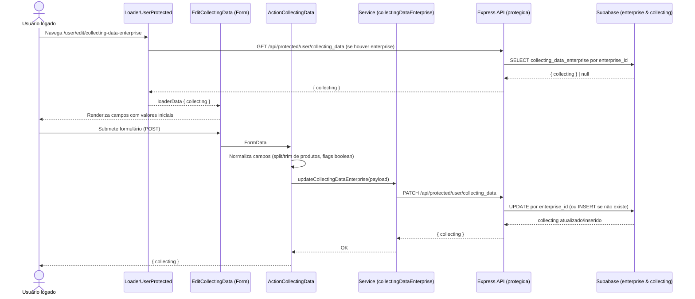

# Fluxo de Edição de Coleta de Dados da Empresa (pages/user/edit/editCollectingData.tsx)

Este documento descreve o fluxo completo da tela de Edição de Coleta de Dados: front-end (página, campos e action), services do cliente, API protegida (Express) e banco (Supabase). Mostra por onde os dados passam, quais arquivos compõem o fluxo e como tudo se conecta.

## Visão geral

- A rota `/user/edit/collecting-data-enterprise` é protegida pelo `LoaderUserProtected` no segmento `/user`.
- A página `EditCollectingData` renderiza um cabeçalho e o formulário `FormCollectingDataEnterprise`.
- O formulário usa estado local para os campos e envia via `<Form method="post">` para a `ActionCollectingData`.
- A `ActionCollectingData` normaliza os dados (especialmente a lista de produtos/serviços) e chama o service para persistir.
- A API protegida resolve a empresa do usuário e faz update/upsert em `collecting_data_enterprise`.

---

## Front-end

### Rota e Loader

- Arquivo: `src/routes/user.tsx`
  - Rota: `path="edit/collecting-data-enterprise"` → `element={<EditCollectingData />}` e `action={ActionCollectingData}`
- Arquivo: `src/routes/loaders/loaderUserProtected.ts`
  - Carrega `{ user, enterprise, collecting }` (quando há enterprise) e redireciona para `/login` se não houver sessão.

### Página e Componentes

- Arquivo: `pages/user/edit/editCollectingData.tsx`
  - Renderiza `Header` (navegação) e `CardSimple` contendo `FormCollectingDataEnterprise`.

- Arquivo: `components/user/profile/editCollectingData/header.tsx`
  - Cabeçalho com título e links: `/user/profile` e `/user/edit/profile`.

- Arquivo: `components/user/profile/editCollectingData/formCollectingDataEnterprise.tsx`
  - Consome `collecting` do `useRouteLoaderData('user')` para preencher valores iniciais.
  - Estados controlados para:
    - `company_objective`
    - `analytics_goal`
    - `business_summary`
    - `uses_company_products` (toggle)
    - `main_products_or_services` (como texto multiline, um item por linha)
  - Exibe campos:
    - `FieldCompanyObjective`, `FieldAnalyticsGoal`, `FieldBusinessSummary`, `FieldUsesCompanyProducts`, `FieldMainProducts` (condicional ao toggle)
  - Envia via `<Form method="post">` para a action da rota, com inputs nomeados conforme os campos.

- Campos (UI):
  - `components/user/profile/editCollectingData/fields/*.tsx`
  - Tipos dos props dos campos: `lib/interfaces/user/propsCollectingDataEnterprise.ts`

---

## Action

- Arquivo: `src/routes/actions/actionCollectingData.ts`
  - Lê `FormData` e extrai strings para cada campo.
  - Interpreta `uses_company_products` considerando valores `on/true/1`.
  - Quebra `main_products_or_services` em linhas, faz `trim` e filtra vazios.
  - Monta payload para o service, convertendo strings vazias em `null` e array vazio em `null`.
  - Em sucesso: responde `200 { collecting }`.
  - Em falha: `400 { error: 'upsert_failed' }`.

---

## Services do cliente

- Arquivo: `src/services/collectingDataEnterprise.ts`
  - `getCollectingDataEnterprise()` → `GET /api/protected/user/collecting_data` → `{ collecting } | null` (trata 400/404 como null)
  - `updateCollectingDataEnterprise(payload)` → `PATCH /api/protected/user/collecting_data`
    - Body JSON com os campos parciais; retorna `{ collecting }`.

- Obs.: as requisições usam `credentials: 'include'` (sessão via cookies httpOnly) e lançam erro em `!res.ok`.

---

## Backend (Express)

- Registro geral: `src/server/express/routes/protected.ts` → `CollectingDataEnterprise(app)`
- Middleware: `src/server/express/middleware/auth.ts` (`requireAuth`) cria cliente SSR e valida o usuário.

### Endpoint GET (carregar dados)

- Arquivo: `endpoints/protected/collectingDataEnterprise.ts`
- `GET /api/protected/user/collecting_data`
  - Busca `enterprise.id` por `auth_user_id` do usuário logado.
  - Seleciona em `collecting_data_enterprise` por `enterprise_id` com `.maybeSingle()`.
  - Retorna `{ collecting }` ou `{ collecting: null }` se não houver registro.
  - Erros: `404 collecting_data_not_found` quando falha a consulta.

### Endpoint PATCH (atualizar)

- `PATCH /api/protected/user/collecting_data`
  - Resolve `enterprise.id` pelo usuário; 404 `enterprise_not_found` se não achar.
  - Monta `updateData` apenas com campos presentes no payload, sempre atualizando `updated_at`.
  - Tenta `update` por `enterprise_id`:
    - Se não encontrar (erro), faz `insert` (primeiro registro) com os campos coerentes (ex.: zera `main_products_or_services` se `uses_company_products === false`).
  - Retorna `{ collecting }` (atualizado ou inserido).
  - Erros: `400 upsert_failed`.

### Endpoint PUT (upsert idempotente)

- `PUT /api/protected/user/collecting_data`
  - Resolve `enterprise.id` e monta `upsertData` completo (campos + `updated_at`).
  - Faz `upsert` com `onConflict: 'enterprise_id'` e retorna `{ collecting }`.
  - Erros: `400 upsert_failed`.

---

## Banco de dados (Supabase)

### Tabelas

- `enterprise` — relação com o usuário autenticado via `auth_user_id`.
- `collecting_data_enterprise` — armazena:
  - `company_objective`, `analytics_goal`, `business_summary`
  - `main_products_or_services: string[] | null`
  - `uses_company_products: boolean`
  - `created_at`, `updated_at`

### Regras

- Endpoints exigem sessão válida (`requireAuth`). O cliente SSR manipula cookies httpOnly.
- Consistência: quando `uses_company_products === false`, o backend garante `main_products_or_services = null`.

---

## Contratos (API)

### GET /api/protected/user/collecting_data
- 200 OK:
```json
{"collecting":{"id":"...","enterprise_id":"...","company_objective":"...","analytics_goal":"...","business_summary":"...","main_products_or_services":["Item A","Item B"],"uses_company_products":true,"created_at":"...","updated_at":"..."}}
```
- 200 OK (sem registro): `{ "collecting": null }`
- 404: `{ "error": "collecting_data_not_found" }`

### PATCH /api/protected/user/collecting_data
- Body:
```json
{"company_objective":"...","analytics_goal":"...","business_summary":"...","main_products_or_services":["Item A","Item B"],"uses_company_products":true}
```
- 200 OK: `{ "collecting": { ... } }`
- 404: `{ "error": "enterprise_not_found" }`
- 400: `{ "error": "upsert_failed" }`

### PUT /api/protected/user/collecting_data
- Body: igual ao PATCH (pode omitir alguns campos; o endpoint complementa com defaults/nulls).
- 200 OK: `{ "collecting": { ... } }`
- 404: `{ "error": "enterprise_not_found" }`
- 400: `{ "error": "upsert_failed" }`

---

## Diagrama do fluxo (Mermaid)



---

## Observações e melhorias sugeridas

- Validação no front: considerar Zod para garantir limites mínimos/máximos e tamanho de texto (ex.: 2–500 chars) antes de enviar.
- UX de produtos: exibir contador de linhas válidas e preview em chips; remover duplicados antes de enviar.
- Mensagens de feedback: mostrar toast de sucesso/erro após submit; instruir o usuário quando a coleção for desativada (`uses_company_products=false`).
- Idempotência: a rota PUT já cobre upsert; pode ser usada em cenários de "salvar tudo" para lógica mais simples.
- Padronização de erros: mapear `enterprise_not_found`, `collecting_data_not_found`, `upsert_failed` para mensagens amigáveis no client.
