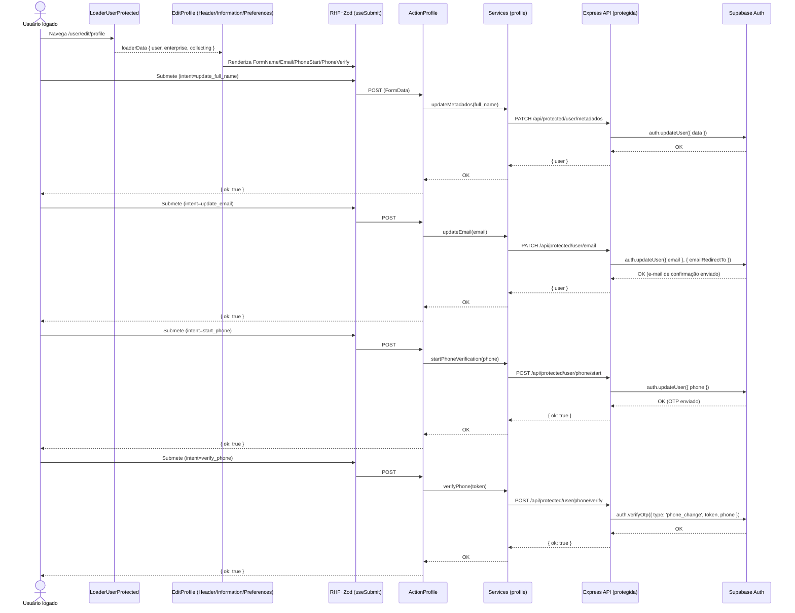

# Fluxo de Edição de Perfil (pages/user/edit/editProfile.tsx)

Este documento descreve o fluxo completo da tela de Edição de Perfil: front-end (página, componentes, forms e action), services do cliente, API protegida (Express) e banco (Supabase Auth + tabelas). Mostra por onde os dados passam, os arquivos envolvidos e como tudo se conecta.

## Visão geral

- A rota `/user/edit/profile` é protegida pelo `LoaderUserProtected` (no segmento `/user`).
- A página `EditProfile` renderiza três blocos: `Header`, `Information` (com formulários) e `Preferences`.
- Os formulários usam `react-hook-form` + `zod` e submetem via `useSubmit` para a `ActionProfile`, que decide o que fazer com base no campo `intent`.
- A `ActionProfile` chama services do cliente que atingem endpoints PROTEGIDOS da API, que usam o cliente SSR do Supabase para validar sessão e atualizar dados (Auth e/ou tabelas).

---

## Front-end

### Rota e Action

- Arquivo: `src/routes/user.tsx`
  - Rota: `path="edit/profile"` → `element={<EditUser />}` e `action={ActionProfile}`
- Arquivo: `src/routes/loaders/loaderUserProtected.ts`
  - Carrega `{ user, enterprise, collecting }` e redireciona para `/login` se não houver sessão.
- Arquivo: `src/routes/actions/actionProfile.ts`
  - Lê `FormData` do POST, checa `intent` e chama o service correspondente:
    - `update_full_name` → `updateMetadados(full_name)`
    - `update_email` → `updateEmail(email)`
    - `start_phone` → `startPhoneVerification(phone)`
    - `verify_phone` → `verifyPhone(token)`
  - Retorna `{ ok: true }` em sucesso; `{ error: 'invalid_payload' | 'invalid_intent' }` em falhas de validação/intent.

### Página e Componentes

- Arquivo: `pages/user/edit/editProfile.tsx`
  - Renderiza blocos: `Header`, `Information`, `Preferences`.

- Arquivo: `components/user/profile/editUser/header.tsx`
  - Cabeçalho simples com título e links de navegação: `/user/profile` e `/user/edit/collecting-data-enterprise`.

- Arquivo: `components/user/profile/editUser/information.tsx`
  - Props opcionais para valores default: `{ defaultFullName, defaultEmail, defaultPhone }`.
  - Renderiza formulários:
    - `FormNameUser` (alterar nome/`user_metadata.full_name`)
    - `FormEmailUser` (alterar `user.email`)
    - `FormPhoneStartUser` (iniciar troca de telefone com OTP)
    - `FormPhoneVerifyUser` (confirmar OTP)

- Arquivo: `components/user/profile/editUser/preferences.tsx`
  - Placeholder de UI para preferências (tema etc.). Sem integração ainda.

### Forms

- Arquivo: `components/user/profile/editUser/forms/formNameUser.tsx`
  - Valida com `nameSchema` (Zod). Submete `intent=update_full_name` e `full_name` via `useSubmit`.

- Arquivo: `components/user/profile/editUser/forms/formEmailUser.tsx`
  - Valida com `emailUpdateSchema`. Submete `intent=update_email` e `email`.

- Arquivo: `components/user/profile/editUser/forms/formPhoneStartUser.tsx`
  - Valida com `phoneStartSchema`. Submete `intent=start_phone` e `phone`.

- Arquivo: `components/user/profile/editUser/forms/formPhoneVerifyUser.tsx`
  - Valida com `phoneVerifySchema`. Submete `intent=verify_phone` e `token`.

- Schemas usados (Zod):
  - `lib/schemas/user/nameSchema.ts`, `emailUpdateSchema.ts`, `phoneSchema.ts`.

---

## Services do cliente

- Arquivo: `src/services/profile.ts`
  - `updateMetadados(full_name)` → `PATCH /api/protected/user/metadados` → atualiza `user_metadata` no Supabase Auth.
  - `updateEmail(email)` → `PATCH /api/protected/user/email` → inicia fluxo de troca de email (Supabase envia e-mail de confirmação; `emailRedirectTo` configurado para retorno).
  - `startPhoneVerification(phone)` → `POST /api/protected/user/phone/start` → salva telefone (estado "pendente") e dispara envio de OTP (SMS) via Supabase.
  - `verifyPhone(token)` → `POST /api/protected/user/phone/verify` → confirma OTP (tipo `phone_change`) e consolida a troca.
- Obs.: `getJson` usa `credentials: 'include'` e lança erro em `!res.ok` com `status`.

---

## Backend (Express)

- Registro geral de rotas protegidas: `src/server/express/routes/protected.ts`
  - Inclui: `User`, `Enterprise`, `Metadados`, `Email`, `CollectingDataEnterprise`, `VerifyPhone`, etc.

- Middleware de proteção: `src/server/express/middleware/auth.ts`
  - Cria cliente SSR (`createSupabaseServerClient`) com cookies httpOnly e valida usuário (`supabase.auth.getUser()`).

### Endpoints usados na edição de perfil

- `PATCH /api/protected/user/metadados` — Arquivo: `endpoints/protected/metadados.ts`
  - Valida `metadadosUpdateSchema` e chama `supabase.auth.updateUser({ data })`.
  - Resposta (200): `{ user: { id, email, user_metadata } | null }`.
  - Erros: 400 `invalid_payload` | `update_failed`.

- `PATCH /api/protected/user/email` — Arquivo: `endpoints/protected/email.ts`
  - Valida `emailUpdateSchema`, monta `emailRedirectTo` (com base em `PUBLIC_SITE_URL`/headers) e chama `supabase.auth.updateUser({ email }, { emailRedirectTo })`.
  - Resposta (200): `{ user: { id, email } | null }`.
  - Erros: 400 `invalid_payload` | `update_failed`.

- `POST /api/protected/user/phone/start` — Arquivo: `endpoints/protected/verify.ts`
  - Valida existência de `phone`; chama `supabase.auth.updateUser({ phone })` (inicia processo de troca/OTP).
  - Resposta (200): `{ ok: true }`.
  - Erros: 400 `invalid_payload` | `update_failed`.

- `POST /api/protected/user/phone/verify` — Arquivo: `endpoints/protected/verify.ts`
  - Valida `token` e `phone`; chama `supabase.auth.verifyOtp({ type: 'phone_change', token, phone })`.
  - Resposta (200): `{ ok: true }`.
  - Erros: 400 `invalid_payload` | `verify_failed`.

---

## Banco de dados (Supabase)

### Entidades envolvidas

- Supabase Auth (usuário):
  - Campos: `id`, `email`, `phone`, `user_metadata` (ex.: `full_name`).
  - Operações: `updateUser` para `data` (metadados), `email` e `phone`; `verifyOtp` para confirmar troca de telefone.

- Tabelas de domínio:
  - Esta tela não altera diretamente `enterprise` ou `collecting_data_enterprise` (essas são geridas em outra tela de edição). Porém o `LoaderUserProtected` enriquece a `enterprise` com `email/phone/full_name` do Auth para exibição.

### Regras

- Todas as rotas são protegidas (`requireAuth`) e usam o cliente SSR com cookies httpOnly.
- Fluxos de email/telefone seguem confirmações nativas do Supabase (link via e-mail, OTP via SMS).

---

## Contratos (API)

### PATCH /api/protected/user/metadados
- Body: `{ "full_name": "Nome" }`
- 200 OK:
```json
{"user":{"id":"...","email":"...","user_metadata":{"full_name":"Nome"}}}
```
- 400: `{ "error": "invalid_payload" | "update_failed" }`

### PATCH /api/protected/user/email
- Body: `{ "email": "novo@exemplo.com" }`
- 200 OK:
```json
{"user":{"id":"...","email":"novo@exemplo.com"}}
```
- 400: `{ "error": "invalid_payload" | "update_failed" }`

### POST /api/protected/user/phone/start
- Body: `{ "phone": "+55DDXXXXXXXXX" }`
- 200 OK: `{ "ok": true }`
- 400: `{ "error": "invalid_payload" | "update_failed" }`

### POST /api/protected/user/phone/verify
- Body: `{ "token": "123456", "phone": "+55DDXXXXXXXXX" }`
- 200 OK: `{ "ok": true }`
- 400: `{ "error": "invalid_payload" | "verify_failed" }`

---

## Diagrama do fluxo (Mermaid)



---

## Observações e melhorias sugeridas

- Prefill: passar `defaultFullName`, `defaultEmail` e `defaultPhone` para `Information` a partir do `loaderData` para experiência melhor (hoje os defaults são opcionais e não são passados na página).
- UX feedback: após cada submit, exibir toast/sucesso e instrução específica (ex.: para e-mail, "verifique o link enviado").
- Estados de loading/desabilitar: desabilitar botões durante submit para evitar cliques múltiplos.
- Normalização de telefone: garantir formato E.164; já há validação via Zod, mas normalize antes do envio para evitar erros de verificação.
- Tratamento de erros padronizado: mapear `invalid_payload`, `update_failed`, `verify_failed` em mensagens amigáveis.
