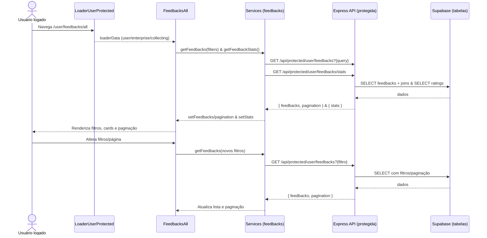

# Fluxo da Lista de Feedbacks (pages/user/feedbacks/feedbacksAll.tsx)

Este documento descreve o fluxo completo da página "FeedbacksAll": front-end (página e componentes), services do cliente, API protegida (Express) e banco (Supabase). Mostra por onde os dados passam, quais arquivos compõem o fluxo e como tudo se conecta.

## Visão geral

- A listagem é acessível em `/user/feedbacks/all` (rota filha de `/user`, com loader protegido).
- A página carrega a lista paginada filtrável de feedbacks e também as estatísticas agregadas.
- As chamadas usam endpoints PROTEGIDOS, que exigem sessão httpOnly gerida pelo cliente SSR do Supabase.
- O backend identifica a empresa do usuário logado, aplica filtros/paginação e retorna dados já com joins úteis (collection_points e tracked_devices/customer).

---

## Front-end

### Página `FeedbacksAll`

- Arquivo: `pages/user/feedbacks/feedbacksAll.tsx`
  - Estados:
    - `feedbacks: Feedback[]`, `stats: FeedbackStats | null`
    - `filters: { page, limit, rating?, search? }` (default: page=1, limit=10)
    - `pagination`, `loading`, `error`, `selectedFeedback`
  - Efeitos (memoizados com `useCallback`):
    - `fetchFeedbacks()` → `getFeedbacks(filters)` e atualiza `feedbacks` + `pagination`.
    - `fetchStats()` → `getFeedbackStats()` e atualiza `stats`.
    - `useEffect`: roda ambos no mount e quando filtros mudam (apenas a lista, stats sem deps extras).
  - Handlers de UI:
    - `handleSearchChange`, `handleRatingFilter`, `handlePageChange`, `handleLimitChange`
  - Renderização:
    - `FeedbackHeader stats={stats}`
    - `FeedbackFiltersComponent filters={...}`
    - Mapeia `feedbacks` em `FeedbackCard`
    - `FeedbackPagination` quando `totalPages > 1`
    - Modal de detalhes ao clicar em um card (usa `selectedFeedback`)

### Componentes de UI

- `components/user/feedbacks/feedbackHeader.tsx`
  - Recebe `FeedbackStats` e exibe total, média e quebra por sentimento.
- `components/user/feedbacks/feedbackFilters.tsx`
  - Recebe `filters` e callbacks; controla busca (texto), filtro por `rating` e `limit` por página.
- `components/user/feedbacks/feedbackCard.tsx`
  - Exibe rating (com estrelas e label), mensagem, canal (collection_points) e cliente (se houver).
- `components/user/feedbacks/feedbackPagination.tsx`
  - Mostra faixa exibida, botões anterior/próximo e no máx. 5 páginas.

### Services do cliente

- Arquivo: `src/services/feedbacks.ts`
  - `getFeedbacks(filters?: FeedbackFilters)`
    - Monta querystring com `page`, `limit`, `rating`, `search`.
    - GET `/api/protected/user/feedbacks?{query}`
    - Retorno: `FeedbacksResponse` (`feedbacks` + `pagination`).
  - `getFeedbackStats()`
    - GET `/api/protected/user/feedbacks/stats`
    - Retorno: `FeedbackStats`.

### Tipos

- Arquivo: `lib/interfaces/user/feedback.ts`
  - Define `Feedback`, `CollectionPoint`, `TrackedDevice` (+ `customer`), `FeedbacksResponse`, `FeedbackStats`, `FeedbackFilters`, `FeedbackPagination` etc.

---

## Backend (Express)

- Middleware `requireAuth` (SSR Supabase):
  - Lê cookies e valida sessão com `supabase.auth.getUser()`; anexa `req.user` e `req.supabase`.

### Endpoint: GET /api/protected/user/feedbacks

- Arquivo: `src/server/express/routes/endpoints/protected/feedbacks.ts`
- Passos:
  1. Lê `page` (default 1), `limit` (default 10), `rating?`, `search?`.
  2. Busca `enterprise.id` pelo `auth_user_id` do usuário;
     - Erro: 404 `enterprise_not_found` se não existir.
  3. Query base em `feedback` com join inner em `collection_points` e join em `tracked_devices.customer`;
     - Filtro fixo `.eq('enterprise_id', enterprise.id)` e ordenação desc por `created_at`.
  4. Aplica filtros: `eq('rating', rating)` e `ilike('message', %search%)` se informados.
  5. Conta total (query separada) para paginação; erro 500 `failed_to_count_feedbacks` se falhar.
  6. Aplica `.range(offset, offset+limit-1)` e retorna lista.
  7. Monta `pagination` com `totalPages`, `hasNextPage/hasPreviousPage`.

### Endpoint: GET /api/protected/user/feedbacks/stats

- Passos:
  1. Resolve `enterprise.id` como acima; 404 `enterprise_not_found` se não existir.
  2. Seleciona `rating` de todos os feedbacks da empresa.
  3. Calcula em memória:
     - `totalFeedbacks`, `averageRating` (1 casa), `ratingDistribution` (1..5), `sentimentBreakdown` (positivo=4|5, neutro=3, negativo=1|2).
  4. Erros: 500 `failed_to_fetch_stats` | `internal_server_error`.

---

## Banco de dados (Supabase)

### Tabelas envolvidas

- `enterprise` — resolve a empresa pelo `auth_user_id` do usuário autenticado.
- `feedback` — fonte dos feedbacks; contém `message`, `rating`, `created_at`, `enterprise_id` e FKs.
- `collection_points` — join inner para obter `id`, `name`, `type`, `identifier` do ponto de coleta.
- `tracked_devices` e `customer` — join opcional para enriquecer com device e cliente (se houver).

### Regras

- RLS via SSR: endpoints protegidos dependem da sessão do usuário (cookies httpOnly).
- Otimizações possíveis: mover agregações de stats para SQL (AVG/COUNT) se volume crescer.

---

## Contratos (API)

### GET /api/protected/user/feedbacks
- Query: `page`, `limit`, `rating`, `search` (opcionais)
- 200 OK:
```json
{
  "feedbacks": [
    {
      "id": "...",
      "message": "...",
      "rating": 5,
      "created_at": "...",
      "updated_at": "...",
      "collection_points": {"id":"...","name":"...","type":"QR_CODE","identifier":null},
      "tracked_devices": {
        "id":"...",
        "device_fingerprint": null,
        "user_agent": null,
        "ip_address": null,
        "feedback_count": 4,
        "is_blocked": false,
        "customer_id": "...",
        "customer": {"id":"...","name":"...","email":"...","gender":"..."}
      }
    }
  ],
  "pagination": {
    "currentPage": 1,
    "totalPages": 10,
    "totalItems": 100,
    "itemsPerPage": 10,
    "hasNextPage": true,
    "hasPreviousPage": false
  }
}
```
- Erros: 404 `enterprise_not_found`; 500 `failed_to_count_feedbacks` | `failed_to_fetch_feedbacks` | `internal_server_error`.

### GET /api/protected/user/feedbacks/stats
- 200 OK:
```json
{
  "totalFeedbacks": 42,
  "averageRating": 4.3,
  "ratingDistribution": {"1":2,"2":3,"3":5,"4":12,"5":20},
  "sentimentBreakdown": {"positive":32,"neutral":5,"negative":5}
}
```
- Erros: 404 `enterprise_not_found`; 500 `failed_to_fetch_stats` | `internal_server_error`.

---

## Diagrama do fluxo (Mermaid)



---

## Sugestões de melhorias (legibilidade, simplicidade e padrão)

- Debounce na busca: aplicar debounce (300–500ms) em `handleSearchChange` para reduzir chamadas.
- Cache curto para stats: as estatísticas mudam menos que a lista; considerar cache de 15–30s no servidor.
- Agregações em SQL: mover média e distribuição para consultas agregadas (AVG/COUNT) melhora performance em grande volume.
- Tratamento de erros padronizado: mapear `enterprise_not_found`, `failed_to_*` para mensagens amigáveis no front.
- Acessibilidade/UX: focar o primeiro card ao usar teclado; aria-modal no overlay de detalhes; fechar com ESC.
