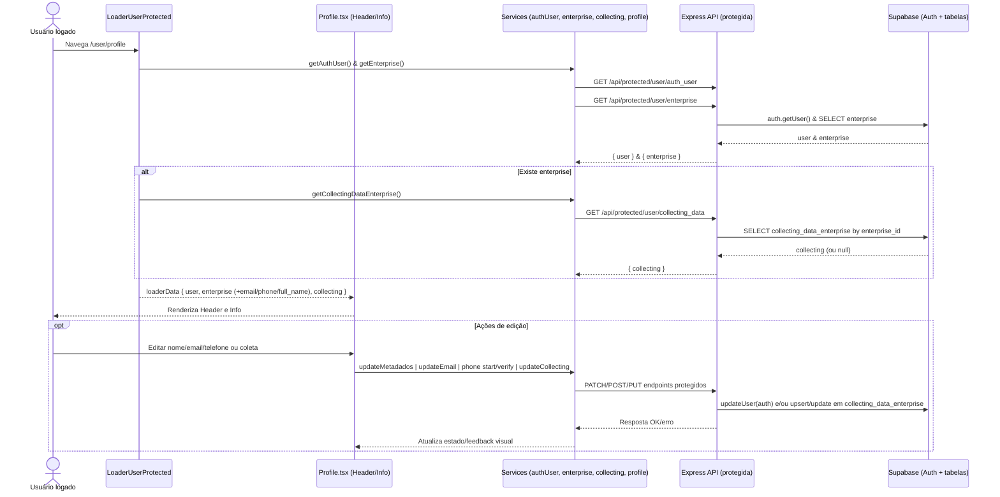

# Fluxo do Perfil do Usuário (pages/user/profile.tsx)

Este documento explica o fluxo completo da página de Perfil: front-end (página, loader e componentes), serviços do cliente, API protegida (Express) e banco (Supabase). Mostra por onde os dados passam, quais arquivos compõem esse fluxo e como tudo se conecta.

## Visão geral

- O loader protegido da rota `/user` carrega `user`, `enterprise` e `collecting` antes de renderizar as rotas filhas (incluindo o Perfil).
- A página `Profile` consome esses dados do loader e renderiza dois componentes: `Header` (avatar + nome + CTAs de edição) e `Info` (detalhes de contato e coleta da empresa).
- Atualizações de dados (nome, email, telefone, coleta) são feitas por serviços do cliente que chamam endpoints PROTEGIDOS (exigem sessão válida mantida via cookies httpOnly pelo SSR do Supabase).

---

## Front-end

### Rota protegida e Loader

- Arquivo: `src/routes/user.tsx`
  - Define o segmento `/user` com `loader={LoaderUserProtected}` e suas rotas filhas (`profile`, `dashboard`, etc.).
- Arquivo: `src/routes/loaders/loaderUserProtected.ts`
  - Fluxo:
    1. Busca usuário autenticado: `getAuthUser()` → `GET /api/protected/user/auth_user`.
    2. Busca empresa do usuário: `getEnterprise()` (ignora erro se não houver).
    3. Se houver empresa, busca dados de coleta: `getCollectingDataEnterprise()`.
    4. Monta o objeto `enterprise` enriquecendo com `email`, `phone` e `full_name` vindos do `auth.user`.
    5. Retorna `{ user, enterprise, collecting }` para uso com `useRouteLoaderData('user')`.
  - Em erro/sem sessão válida: `redirect('/login')`.

### Página Profile

- Arquivo: `pages/user/profile.tsx`
  - Lê `loaderData` do segmento `user`:
    ```ts
    const { enterprise, user, collecting } = useRouteLoaderData('user')
    ```
  - Renderiza:
    - `components/user/profile/header.tsx` (exibe avatar, nome e links para edição)
    - `components/user/profile/info.tsx` (exibe objetivo, contato e dados de coleta)

### Componentes

- Arquivo: `components/user/profile/header.tsx`
  - Props: `PropsEnterpriseAndUser` (empresa + usuário)
  - Renderiza `Avatar`, título (empresa.full_name || user.email) e CTAs:
    - `/user/edit/profile` → edição de perfil (nome, email, telefone)
    - `/user/edit/collecting-data-enterprise` → edição dos dados de coleta

- Arquivo: `components/user/profile/info.tsx`
  - Props: `PropsEnterpriseAndCollectingDataEnterprise` (empresa + coleta)
  - Exibe objetivo e resumo de negócios (`collecting.*`), e bloco de contato:
    - Email (`enterprise.email`)
    - Telefone (formatado por `formatPhone`)
    - Documento (formatado por `formatDocument` conforme `account_type`)
    - Data de criação (`enterprise.created_at`)

---

## Services do cliente

- Arquivo: `src/services/authUser.ts`
  - `getAuthUser()` → `GET /api/protected/user/auth_user` → `{ user }`

- Arquivo: `src/services/enterprise.ts`
  - `getEnterprise()` → `GET /api/protected/user/enterprise` → `{ enterprise, user }`

- Arquivo: `src/services/collectingDataEnterprise.ts`
  - `getCollectingDataEnterprise()` → `GET /api/protected/user/collecting_data` → `{ collecting } | 404`
  - `updateCollectingDataEnterprise(payload)` → `PATCH /api/protected/user/collecting_data`

- Arquivo: `src/services/profile.ts`
  - `updateMetadados(full_name)` → `PATCH /api/protected/user/metadados` → atualiza `user_metadata` (ex.: `full_name`).
  - `updateEmail(email)` → `PATCH /api/protected/user/email` → inicia fluxo de troca de email (Supabase envia email de confirmação; há redirect de confirmação configurado).
  - `startPhoneVerification(phone)` → `POST /api/protected/user/phone/start` → inicia fluxo OTP para telefone.
  - `verifyPhone(token)` → `POST /api/protected/user/phone/verify` → confirma OTP do telefone.

- Arquivo: `src/services/http.ts`
  - `getJson`/`postJson` usam `credentials: 'include'` e tratam `!res.ok` lançando erro com `status`.

- Tipos usados:
  - `lib/interfaces/entities/enterprise.ts`, `enterpriseAndUser.ts`, `authUser.ts`.

---

## Backend (Express)

- Middleware de proteção:
  - Arquivo: `src/server/express/middleware/auth.ts` (`requireAuth`)
    - Cria cliente SSR (`createSupabaseServerClient`), valida sessão via `supabase.auth.getUser()`.
    - Em sucesso, anexa `req.user` e `req.supabase`; senão, responde `401 { error: 'unauthorized' }`.

- Registro das rotas protegidas:
  - Arquivo: `src/server/express/routes/protected.ts`
    - Registra: `User`, `Enterprise`, `Metadados`, `Email`, `CollectingDataEnterprise`, `VerifyPhone`, etc.

### Endpoints usados pelo Perfil

- `GET /api/protected/user/auth_user`
  - Arquivo: `endpoints/protected/user.ts`
  - Retorna `req.user` (id, email, phone, user_metadata) do Supabase Auth.

- `GET /api/protected/user/enterprise`
  - Arquivo: `endpoints/protected/enterprise.ts`
  - Busca `enterprise` por `auth_user_id` e retorna também `{ id, email, phone }` do usuário.

- `GET /api/protected/user/collecting_data`
  - Arquivo: `endpoints/protected/collectingDataEnterprise.ts`
  - Resolve `enterprise.id` do usuário e retorna registro em `collecting_data_enterprise` (ou `null` se não existir).

- `PATCH /api/protected/user/collecting_data` e `PUT /api/protected/user/collecting_data`
  - Upsert/atualização dos dados de coleta.

- `PATCH /api/protected/user/metadados`
  - Arquivo: `endpoints/protected/metadados.ts`
  - Valida com `metadadosUpdateSchema` e chama `supabase.auth.updateUser({ data })`.

- `PATCH /api/protected/user/email`
  - Arquivo: `endpoints/protected/email.ts`
  - Valida com `emailUpdateSchema`, calcula `emailRedirectTo` e chama `supabase.auth.updateUser({ email }, { emailRedirectTo })`.

- `POST /api/protected/user/phone/start` e `POST /api/protected/user/phone/verify`
  - Arquivo: `endpoints/protected/verify.ts`
  - Atualiza `phone` e inicia fluxo OTP; depois verifica OTP com `supabase.auth.verifyOtp({ type: 'phone_change', ... })`.

### Cliente Supabase SSR

- Arquivo: `src/server/express/supabase.ts`
  - `createSupabaseServerClient(req, res, opts?)` com cookies httpOnly e `auth.persistSession=false`.

---

## Banco de dados (Supabase)

### Tabelas/Views envolvidas

- `enterprise` — empresa vinculada ao `auth_user_id` (join lógico via campo), contém `document`, `account_type`, `created_at` etc.
- `collecting_data_enterprise` — dados de coleta (objetivo, metas, resumo, produtos, usa-produtos, timestamps) associados à empresa.
- Supabase Auth — dados do usuário: `id`, `email`, `phone`, `user_metadata` (ex.: `full_name`).

### Regras

- Todas as rotas estão sob `requireAuth` (cookies httpOnly). O SSR de Supabase garante leitura/escrita segura com RLS.
- Atualizações de email e telefone usam os fluxos nativos do Supabase (com confirmação via link/OTP).

---

## Contratos (API)

### GET /api/protected/user/auth_user
- 200 OK:
```json
{"user":{"id":"...","email":"...","phone":"...","user_metadata":{"full_name":"..."}}}
```

### GET /api/protected/user/enterprise
- 200 OK:
```json
{"enterprise":{"id":"...","document":"...","account_type":"CNPJ","created_at":"..."},"user":{"id":"...","email":"...","phone":"..."}}
```
- 404: `{ "error": "enterprise_not_found" }`

### GET /api/protected/user/collecting_data
- 200 OK:
```json
{"collecting":{"id":"...","enterprise_id":"...","company_objective":null,"analytics_goal":null,"business_summary":null,"main_products_or_services":[],"uses_company_products":false,"created_at":"...","updated_at":"..."}}
```
- 200 OK (sem registro): `{ "collecting": null }`
- 404: `{ "error": "collecting_data_not_found" }`

### PATCH /api/protected/user/collecting_data
- 200 OK: `{ "collecting": { ...registro atualizado... } }`
- 400: `{ "error": "empty_payload" | "upsert_failed" }`
- 404: `{ "error": "enterprise_not_found" }`

### PUT /api/protected/user/collecting_data
- 200 OK: `{ "collecting": { ...registro atualizado ou inserido... } }`
- 404: `{ "error": "enterprise_not_found" }`

### PATCH /api/protected/user/metadados
- Body: `{ "full_name": "Nome" }`
- 200 OK:
```json
{"user":{"id":"...","email":"...","user_metadata":{"full_name":"Nome"}}}
```
- 400: `{ "error": "invalid_payload" | "update_failed" }`

### PATCH /api/protected/user/email
- Body: `{ "email": "novo@exemplo.com" }`
- 200 OK:
```json
{"user":{"id":"...","email":"novo@exemplo.com"}}
```
- 400: `{ "error": "invalid_payload" | "update_failed" }`

### POST /api/protected/user/phone/start
- Body: `{ "phone": "+55..." }`
- 200 OK: `{ "ok": true }`
- 400: `{ "error": "invalid_payload" | "update_failed" }`

### POST /api/protected/user/phone/verify
- Body: `{ "token": "123456", "phone": "+55..." }`
- 200 OK: `{ "ok": true }`
- 400: `{ "error": "invalid_payload" | "verify_failed" }`

---

## Diagrama do fluxo (Mermaid)



---

## Observações e melhorias sugeridas

- Padronizar mensagens de erro no client para `enterprise_not_found`, `collecting_data_not_found`, `invalid_payload`, etc., exibindo mensagens consistentes.
- Considerar invalidar ou refetchar os dados do loader após updates críticos (ex.: email/telefone) para manter a tela sincronizada.
- Na atualização de coleta, a lógica já faz upsert; se volume crescer, pode-se mover alguns campos para views específicas, mas está ok para o caso atual.
- Garantir máscara/validação de telefone e normalização (E.164) antes de chamar `phone/start`.
- Mostrar feedback claro após mudanças de email (como "verifique sua caixa de entrada"), dado que o fluxo depende de confirmação por link.
