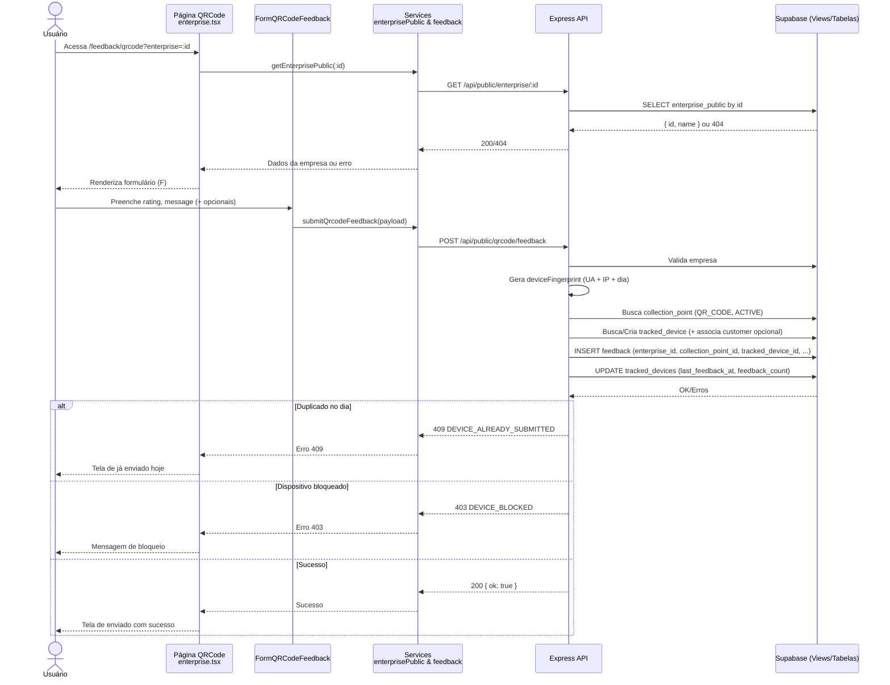

# Fluxo de Feedback via QR Code (pages/public/qrcode/enterprise.tsx)

Este documento descreve o fluxo completo de coleta de feedback por QR Code: front-end (página, formulário e services), backend (endpoints Express) e banco de dados (Supabase), incluindo por onde os dados passam, os arquivos envolvidos e as regras de negócio (rate limiting por dispositivo, bloqueio, e mapeamentos).

## Visão geral

- A página pública `pages/public/qrcode/enterprise.tsx` valida a empresa via query param `?enterprise=<id>` e renderiza um formulário para avaliação e mensagem.
- O front chama dois services:
  - `getEnterprisePublic(enterpriseId)` → GET `/api/public/enterprise/:id` (valida se a empresa existe e obtém nome)
  - `submitQrcodeFeedback(payload)` → POST `/api/public/qrcode/feedback` (envia o feedback)
- O backend valida o payload com Zod, confirma a existência da empresa, identifica o dispositivo (fingerprint por UA + IP + dia), aplica regras de envio (1 por dia; bloqueio), cria/associa cliente opcionalmente, encontra o ponto de coleta QR ativo e registra o feedback.
- Em caso de duplicidade no mesmo dia, retorna `409 DEVICE_ALREADY_SUBMITTED`; se bloqueado, `403 DEVICE_BLOCKED`.

## Front-end

### Página e estados

- Arquivo: `pages/public/qrcode/enterprise.tsx`
- Hooks/Estados:
  - Lê `enterprise` de `useSearchParams`.
  - `isValidatingEnterprise`, `error` → estados de validação da empresa e erros.
  - `formData` (`PropsFeedbackData`): `{ message, rating, enterprise_id }`.
  - `customerData` (`PropsCustomerData`): dados opcionais do cliente.
  - `showOptionalFields`: toggle para abrir/fechar campos opcionais.
  - `isSubmitting`, `isSubmitted`, `hasAlreadySubmitted`.
- Efeitos principais:
  - `useEffect` inicial: valida `enterprise` chamando `getEnterprisePublic(enterpriseId)`; em sucesso seta `enterpriseName` e `formData.enterprise_id`; em falha, `error`.
- Regras de validação simples no submit:
  - `enterprise_id` obrigatório; `rating` > 0; `message` não vazio.
  - Em erro no envio: se `err.status === 409` → seta `hasAlreadySubmitted = true`.

### Formulário

- Componente: `components/public/forms/formQRCodeFeedback.tsx`
  - Campos obrigatórios: `rating` (1–5), `message` (>= 3 chars — validado no backend). No front, `rating > 0` e `message.trim()` são checados.
  - Campos opcionais (controlados por `showOptionalFields`): `customer_name`, `customer_email`, `customer_gender`.
  - Props/sinais vêm de `PropsFormQRCodeFeedback` em `lib/interfaces/public/propsQRcode.ts`.

### Services front

- `src/services/enterprisePublic.ts`
  - `getEnterprisePublic(enterpriseId)` → `getJson<EnterpriseContractResponse>(/api/public/enterprise/:id)`
- `src/services/qrcode/feedback.ts`
  - `submitQrcodeFeedback(payload: QrcodeFeedbackPayload)` → `postJson<PropsQrcodeFeedbackResponse>('/api/public/qrcode/feedback', payload)`
- `src/services/http.ts`
  - `getJson` e `postJson` centralizam `fetch` com `credentials: 'include'` e tratamento de status/erros.

### Schemas e tipos (front)

- `lib/schemas/public/feedbackSchema.ts`
  - `feedbackBaseSchema`: `enterprise_id` (uuid v4), `rating` (1–5), `message` (3–5000), dados de cliente opcionais, etc.
  - `qrcodeFeedbackSchema = feedbackBaseSchema.extend({ channel: z.literal('QRCODE') })`.
  - Types: `QrcodeFeedbackPayload`.
- `lib/interfaces/public/propsQRcode.ts`
  - Shapes de props, resultados e dados opcionais do cliente.

## Backend (Express)

### Validação de empresa pública

- Arquivo: `src/server/express/routes/endpoints/public/enterprise.ts`
- Endpoint: `GET /api/public/enterprise/:id`
- Fluxo:
  1. Valida `id`.
  2. Cria cliente Supabase SSR (`createSupabaseServerClient`).
  3. Consulta `enterprise_public` (view): `select id, name where id = :id`.
  4. Erros: `400 enterprise_id_required`, `404 enterprise_not_found`, `500 internal_server_error`.
  5. Sucesso: `{ id, name }`.

### Recebimento do feedback via QR Code

- Arquivo: `src/server/express/routes/endpoints/public/qrcode/feedback.ts`
- Endpoint: `POST /api/public/qrcode/feedback`
- Fluxo detalhado:
  1. Valida payload com `qrcodeFeedbackSchema` (Zod). Erro → `400 { error: 'invalid_payload' }`.
  2. Cria cliente Supabase SSR.
  3. Verifica empresa: `from('enterprise_public').select('id').eq('id', payload.enterprise_id).single()` → `404 enterprise_not_found` se não existir.
  4. Calcula fingerprint do dispositivo (por dia):
     - `user-agent` + IP + epoch do início do dia → `md5` → `deviceFingerprint`.
  5. Busca `collection_points` ativos da empresa: `type = 'QR_CODE'` e `status = 'ACTIVE'` → se não houver: `404 collection_point_not_found`; erro de consulta: `500 collection_point_error`.
  6. Busca/Cria `tracked_devices`:
     - Tenta `maybeSingle()` por `(enterprise_id, device_fingerprint)`.
     - Se existe:
       - Se `is_blocked` → `403 DEVICE_BLOCKED`.
       - Se `last_feedback_at` for de hoje → `409 DEVICE_ALREADY_SUBMITTED`.
     - Se dados de cliente vierem:
       - Tenta achar `customer` por `email` (se fornecido) para a mesma empresa; se não achar, cria novo `customer` mapeando `gender` (`masculino/feminino/outro/prefiro_nao_informar` → `Masculino/Feminino/Outro/Não Informado`).
     - Se `tracked_device` não existir, cria com `enterprise_id`, `customer_id` (se houver), `device_fingerprint`, `user_agent`, `ip_address`, `last_feedback_at`, `feedback_count` inicial, `is_blocked` false.
     - Se existe e há `customer_id` novo e faltante, atualiza `tracked_devices` para setar essa relação.
  7. Insere `feedback`:
     - Campos: `enterprise_id`, `collection_point_id`, `tracked_device_id`, `message`, `rating`.
     - Em erro: `500 feedback_insert_failed`.
  8. Atualiza `tracked_devices`:
     - `last_feedback_at = now()`, incrementa `feedback_count`, atualiza `user_agent` e `ip_address` (erro aqui não invalida o feedback; apenas log).
  9. Sucesso: `{ ok: true }`.

### Cliente Supabase SSR

- `src/server/express/supabase.ts`
  - `createSupabaseServerClient(req, res)` com gestão de cookies httpOnly e `auth.persistSession = false` (para endpoints públicos não autenticados isso é só formalidade; as tabelas públicas e RLS devem ser configuradas no banco).

## Banco de dados (Supabase)

### Entidades consultadas/atualizadas

- `enterprise_public` (view): valida a existência da empresa e traz nome.
- `collection_points`: busca ponto ativo do tipo `QR_CODE` para a empresa.
- `tracked_devices`: identifica e limita envios por dispositivo (fingerprint diário); pode associar `customer_id`.
- `customer`: cliente opcional (cria/associa se houver `email`/`name`/`gender`).
- `feedback`: onde o feedback é persistido (com `tracked_device_id` e `collection_point_id`).

### Regras de negócio

- 1 feedback por dia por dispositivo (fingerprint = md5(`user-agent|ip|epochDia`)).
- Dispositivo pode ser bloqueado (`is_blocked`) → `403`.
- `collection_points` deve existir e estar `ACTIVE`/`QR_CODE` para receber feedback.
- RLS: inserções são feitas diretamente; leitura de dados sensíveis é evitada no retorno. Há cuidado para não depender de `SELECT` após `INSERT` na mesma transação (para não trombar com RLS).

## Contratos (API)

### GET /api/public/enterprise/:id
- Request: sem body. Parâmetro `:id` obrigatório.
- 200 OK: `{ id: string, name: string }`
- 400: `{ error: 'enterprise_id_required' }`
- 404: `{ error: 'enterprise_not_found' }`
- 500: `{ error: 'internal_server_error' }`

### POST /api/public/qrcode/feedback
- Body (exemplo):
```json
{
  "enterprise_id": "<uuid>",
  "rating": 5,
  "message": "Excelente atendimento",
  "channel": "QRCODE",
  "customer_name": "João",
  "customer_email": "joao@example.com",
  "customer_gender": "masculino"
}
```
- 200 OK: `{ "ok": true }`
- 400: `{ error: 'invalid_payload' }`
- 403: `{ error: 'DEVICE_BLOCKED' }`
- 404: `{ error: 'enterprise_not_found' | 'collection_point_not_found' }`
- 409: `{ error: 'DEVICE_ALREADY_SUBMITTED' }`
- 500: `{ error: 'collection_point_error' | 'device_check_failed' | 'device_creation_failed' | 'feedback_insert_failed' }`

## Arquivos envolvidos (resumo)

Front-end:
- `pages/public/qrcode/enterprise.tsx` — Página pública do QR Code (validação, estados, envio).
- `components/public/forms/formQRCodeFeedback.tsx` — Formulário de avaliação e dados opcionais.
- `lib/interfaces/public/propsQRcode.ts` — Tipos de props e payloads usados no front.
- `lib/schemas/public/feedbackSchema.ts` — Esquema Zod (compartilhado) usado no backend e também disponível no front.
- `src/services/enterprisePublic.ts` — GET empresa pública.
- `src/services/qrcode/feedback.ts` — POST feedback.

Backend:
- `src/server/express/routes/public.ts` — Registra `EnterprisePublic(app)` e `QrcodeFeedback(app)`.
- `src/server/express/routes/endpoints/public/enterprise.ts` — GET `/api/public/enterprise/:id`.
- `src/server/express/routes/endpoints/public/qrcode/feedback.ts` — POST `/api/public/qrcode/feedback`.
- `src/server/express/supabase.ts` — Cliente SSR Supabase.

## Diagrama do fluxo (Mermaid)



## Observações e melhorias sugeridas

- Exibição de mensagens específicas na UI para `DEVICE_BLOCKED` e `collection_point_not_found` pode melhorar a clareza.
- Log estruturado no backend (incluindo hash do device e enterprise_id) facilita investigação e auditoria.
- Caso deseje maior robustez, considerar armazenar também um `salt` por empresa na geração de fingerprint, reduzindo colisões entre ambientes.
- Confirmar políticas RLS nas tabelas (`feedback`, `tracked_devices`, `customer`, `collection_points`, `enterprise_public`) para garantir que os `INSERT` e `SELECT` realizados pelos endpoints públicos estejam autorizados.
