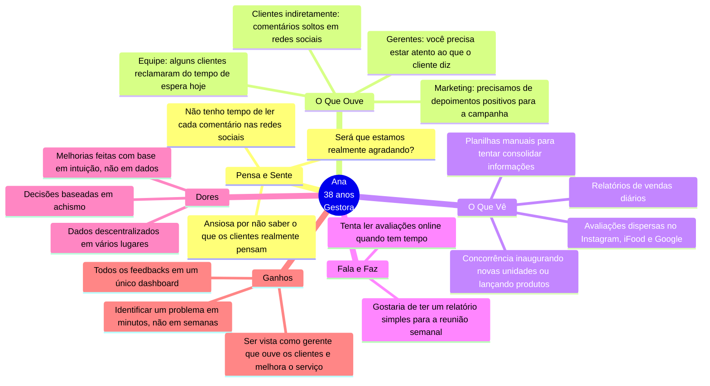
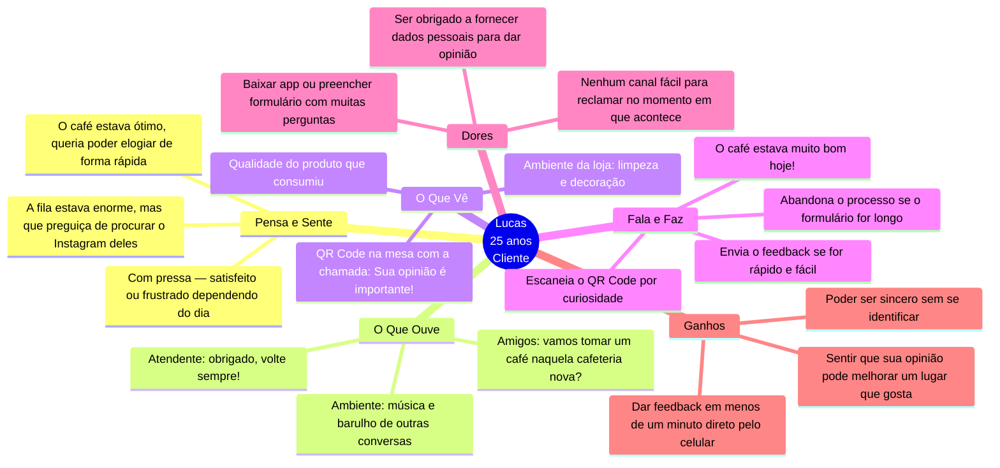
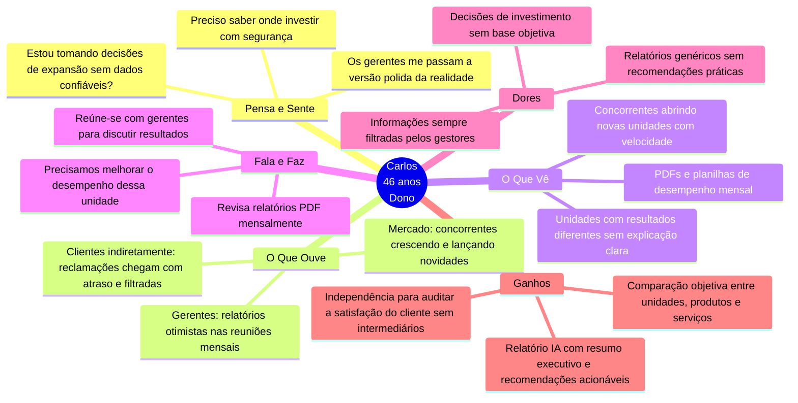

# Personas

> Mapeamento dos perfis reais de usuários do sistema, suas motivações, comportamentos e impacto nas decisões de produto.

---

### Persona 1: A Gestora Sobrecarregada

**"Preciso de dados reais para tomar decisões, não posso mais viver de achismos."**

- **Perfil:** Ana Rocha, 38 anos.
- **Cargo:** Gerente de uma Rede de Cafeterias (3 unidades).
- **Bio:** Ana é multitarefa e vive sob pressão. Ela gerencia equipes, estoques e a qualidade do serviço. Ela se sente ansiosa porque sabe que os clientes reclamam nas redes sociais, mas ela não tem tempo de ler comentário por comentário. Ela depende de planilhas manuais e relatórios de vendas que não dizem *por que* as vendas caíram.
- **Comportamento Digital:** Usa WhatsApp Business para comunicar com a equipe, planilhas Google e Instagram para monitorar menções. Não é tech-savvy mas aprende rápido por necessidade. Acessa principalmente pelo celular durante o dia e pelo computador no fim do expediente.
- **Objetivos:**
    - Ter visibilidade sobre a experiência do cliente em todas as unidades sem depender de relatos filtrados pela equipe.
    - Transformar reclamações em ações corretivas antes que virem crises.
- **Necessidades Principais:**
    - Centralizar feedbacks dispersos (Google, Instagram, iFood) em um único lugar.
    - Agilidade para identificar problemas (ex: café frio ou atendimento lento) em minutos, não em semanas.
    - Relatórios simples e visuais para apresentar nas reuniões semanais.
- **Frustrações:**
    - Tomar decisões importantes baseadas em intuição ou comentários isolados.
    - A sensação de que a informação está espalhada e inacessível.
- **Impacto no Projeto Feedback Analytics:** Ana é a usuária principal do **Dashboard**. A arquitetura **Multi-tenant** é essencial para garantir a segurança dos dados das unidades dela. A dor da falta de tempo justifica a visualização rápida e a **análise com IA**.

#### Mapa de Empatia

**Visualizar o código no site:** https://mermaid.ai/

---

### Persona 2: O Cliente Consciente e Prático

**"Se eu tiver que baixar um app ou fazer login para dar uma opinião, eu simplesmente desisto."**

- **Perfil:** Lucas Silva, 25 anos.
- **Cargo:** Analista de Sistemas e frequentador assíduo da cafeteria.
- **Bio:** Lucas valoriza a qualidade e gosta de frequentar lugares agradáveis. Ele é detalhista e percebe a limpeza, a música e o sabor do produto. Ele está quase sempre com pressa e resolve tudo pelo celular. Ele gostaria de elogiar quando o serviço é bom e alertar sobre problemas, mas acha o processo atual burocrático.
- **Comportamento Digital:** Nativo digital, mobile-first. Usa apps de avaliação (iFood, Google Maps) com naturalidade e tem tolerância zero a atrito. Não cria contas em serviços que usará apenas uma vez.
- **Objetivos:**
    - Dar sua opinião de forma rápida e honesta quando a experiência merece — para o bem ou para o mal.
    - Sentir que seu feedback chega diretamente a quem pode mudar algo, sem passar por filtros públicos.
- **Necessidades Principais:**
    - Um método de feedback sem atrito: escanear o QR Code e responder em menos de 1 minuto.
    - Garantia de **anonimato**: ele quer ser sincero sem precisar fornecer dados pessoais ou criar contas.
    - Um canal direto: ele prefere falar com a empresa do que reclamar publicamente no Instagram deles.
- **Frustrações:**
    - Formulários longos, com muitas perguntas obrigatórias ou que pedem login.
    - Ter que procurar o perfil da empresa nas redes sociais para fazer uma reclamação ou elogio no momento em que o fato acontece.
- **Impacto no Projeto Feedback Analytics:** Lucas é o usuário do **Frontend de Coleta**. A dor do processo complicado justifica a arquitetura **SPA** para carregamento rápido. A necessidade de privacidade justifica o sistema de **tracked_devices** e **coleta anônima**.

#### Mapa de Empatia

**Visualizar o código no site:** https://mermaid.ai/

---

### Persona 3: O Dono Estratégico

**"Preciso saber se meu negócio está crescendo na direção certa, não só apagar incêndios."**

- **Perfil:** Carlos Mendes, 46 anos.
- **Cargo:** Sócio-fundador de uma rede de cafeterias (5 unidades) e investidor em outros negócios de alimentação.
- **Bio:** Carlos delegou a operação diária para gestores como Ana, mas precisa de uma visão consolidada para tomar decisões estratégicas: abrir nova unidade, encerrar um produto do cardápio, investir em treinamento de equipe. Ele não acompanha o dashboard diariamente — mas quer receber um relatório periódico que mostre tendências reais, e não uma versão polida da realidade filtrada pelo gestor.
- **Comportamento Digital:** Consome relatórios por e-mail e PDF. Prefere ferramentas que não exigem treinamento. Acessa pelo celular quando está em movimento e pelo notebook em reuniões. Desconfia de sistemas complexos e abandona produtos que exigem configuração longa.
- **Objetivos:**
    - Tomar decisões de expansão e melhoria com base em dados objetivos do cliente, não em percepções da equipe.
    - Comparar o desempenho de unidades, produtos e serviços de forma consolidada.
    - Identificar tendências de insatisfação antes que se tornem problemas de churn.
- **Necessidades Principais:**
    - Relatório consolidado gerado pela IA com resumo executivo e recomendações práticas.
    - Visão segmentada por produto, serviço ou departamento — não apenas a nota geral da empresa.
    - Indicadores claros (positivos, neutros, críticos) sem necessidade de interpretar dados brutos.
- **Frustrações:**
    - Receber informações filtradas pelos gestores — querer saber o que o cliente realmente pensa, sem intermediários.
    - Relatórios genéricos que mostram números mas não dizem o que precisa mudar.
    - Não ter como comparar objetivamente o desempenho de diferentes unidades ou itens do cardápio.
- **Impacto no Projeto Feedback Analytics:** Carlos é o usuário principal da tela de **Relatório IA** e da funcionalidade `feedback_insights_report`. A segmentação por `scope_type` (`COMPANY`, `PRODUCT`, `SERVICE`, `DEPARTMENT`) foi desenhada para atender a granularidade que ele precisa. A seção de **recomendações práticas** da IA existe para traduzir dados em ação sem exigir interpretação manual.

#### Mapa de Empatia

**Visualizar o código no site:** https://mermaid.ai/

---

## Resumo dos Perfis

| | Ana — Gestora Sobrecarregada | Lucas — Cliente Consciente | Carlos — Dono Estratégico |
|---|---|---|---|
| **Relação com o produto** | Usuária diária do dashboard | Usuário esporádico do formulário público | Usuário periódico do relatório IA |
| **Principal entrega de valor** | Identificação rápida de problemas operacionais | Feedback anônimo e sem atrito | Insights consolidados para decisão estratégica |
| **Maior medo** | Perder um problema que virou crise | Ter sua opinião rastreada | Expandir ou investir na direção errada |
| **Feature crítica** | Dashboard, cards de métricas, listagem de feedbacks | Formulário público, QR Code, coleta anônima | Relatório IA, `scope_type`, recomendações |
| **Nível de maturidade digital** | Intermediário | Avançado | Básico / Intermediário |
