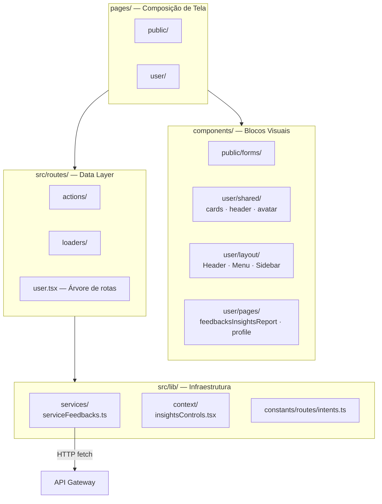
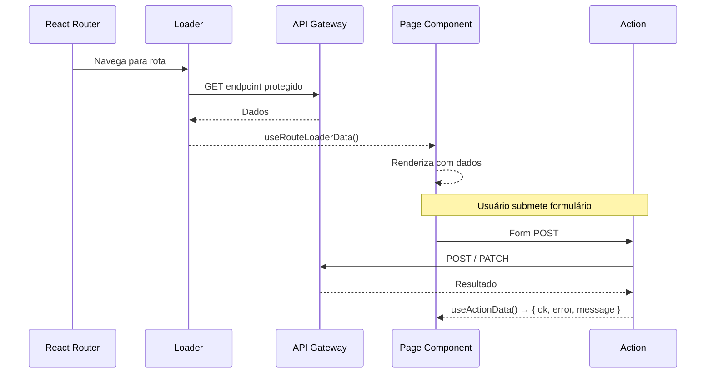

# Frontend — Arquitetura e Estrutura de Componentes

## Como as Camadas se Organizam

O frontend separa responsabilidades em quatro camadas. Cada camada tem uma função clara — nenhuma "pula" outra:

- **Pages** (`pages/`) — montam a tela combinando componentes. Não têm lógica de negócio.
- **Components** (`components/`) — blocos visuais reutilizáveis. Recebem props, emitem eventos.
- **Routes** (`src/routes/`) — loaders buscam dados; actions processam mutations.
- **Lib** (`src/lib/`) — serviços HTTP, contextos React, constantes e mocks.



---

## Fluxo de Dados em uma Página Protegida



---

## Componentes Novos Nesta Release

### `InsightsHeaderControls`

Barra de controles do painel de insights (`/user/insights/reports`). Combina três elementos:

1. **`ScopeSelectorRadial`** — seletor de escopo animado em leque
2. **`HeaderSelect`** — dropdown para item de catálogo (quando escopo ≠ `COMPANY`)
3. **Botões de ação** — "Analisar feedbacks" e "Gerar insights"

```typescript
interface InsightsHeaderControlsProps {
  refreshing: boolean;
  analyzingRaw: boolean;
  canAnalyze: boolean;
  availableScopes: InsightScopeOption[];
  selectedScope: InsightScopeOption;
  selectedCatalogItemId: string;
  catalogItemOptions: InsightsCatalogItemOption[];
  onScopeChange: (scope: InsightScopeOption) => void;
  onCatalogItemChange: (id: string) => void;
  onRefreshSelected: () => void;
  onAnalyzeRaw: () => void;
}
```

---

### `ScopeSelectorRadial`

Seletor circular com animação de leque. Um botão central exibe o escopo selecionado; ao clicar, abre sub-botões posicionados em arco abaixo com delay escalonado.

| Posição | Escopo | Cor |
|---|---|---|
| 0 | `COMPANY` | Indigo `#6366f1` |
| 1 | `PRODUCT` | Verde `#10b981` |
| 2 | `SERVICE` | Âmbar `#f59e0b` |
| 3 | `DEPARTMENT` | Rosa `#ec4899` |

O backdrop invisível (`position: fixed; inset: 0; z-index: 97`) fecha o seletor ao clicar fora.

---

### `InsightsControlsContext`

Contexto React que evita prop drilling no painel de insights. Expõe dois hooks:

```typescript
// Dentro do Provider — para leitura
const { scope, catalogItemId, canAnalyze } = useInsightsControls();

// No componente pai — para inicializar o estado
const state = useInsightsControlsState({ catalogItemOptions, availableScopes, canAnalyze });
```

---

### `Header` (Componente Compartilhado)

Cabeçalho genérico reutilizável nas páginas de edição. Aceita navegação configurável:

```typescript
interface HeaderProps {
  enterprise: Enterprise;
  user: AuthUser['user'];
  description?: string;
  nextLink?: string;        // "Próxima etapa"
  nextLabelLink?: string;
  prevLink?: string;        // "Etapa anterior"
  prevLabelLink?: string;
}
```

---

## Estrutura de Diretórios

```
apps/web/
├── components/
│   ├── public/forms/           → Formulários públicos
│   └── user/
│       ├── layout/             → Header, Menu, Sidebar
│       ├── shared/             → Cards, Avatar, Header genérico
│       └── pages/
│           ├── feedbacksInsightsReport/
│           │   ├── InsightsHeaderControls.tsx
│           │   ├── ScopeSelectorRadial.tsx
│           │   └── InsightsReportHeaderSection.tsx
│           └── profile/
│               ├── editFeedbackSettings/formFeedbackCatalog.tsx
│               └── editTypesFeedback/formTypesFeedback.tsx
├── pages/user/edit/
│   ├── editTypeFeedbacks.tsx       → /user/edit/types-feedback
│   ├── editFeedbackSettings.tsx    → /user/edit/feedback-settings (hub)
│   ├── editFeedbackProducts.tsx    → /user/edit/feedback-products
│   ├── editFeedbackServices.tsx    → /user/edit/feedback-services
│   └── editFeedbackDepartments.tsx → /user/edit/feedback-departments
├── src/
│   ├── routes/
│   │   ├── user.tsx
│   │   ├── actions/
│   │   └── loaders/
│   └── lib/
│       ├── context/insightsControls.tsx
│       └── constants/routes/intents.ts
└── layouts/
    └── user.tsx                    → Shell: Sidebar + Header
```

---

## Breaking Changes (homolog → main)

:::warning
Os seguintes arquivos foram **removidos** nesta branch:

- `formFeedbackSettings.tsx` (732 linhas) → substituído por `formFeedbackCatalog.tsx` + `formTypesFeedback.tsx`
- `pages/user/edit/editCollectingData.tsx`
- `pages/user/edit/editProfile.tsx`
- `pages/user/qrcodes/qrcodeDepartments.tsx`, `qrcodeProducts.tsx`, `qrcodeServices.tsx`
- Componentes `EditableField`, `EditableFieldFixed`, `SimpleEditableField`

Atualize qualquer importação ou referência a esses arquivos.
:::
