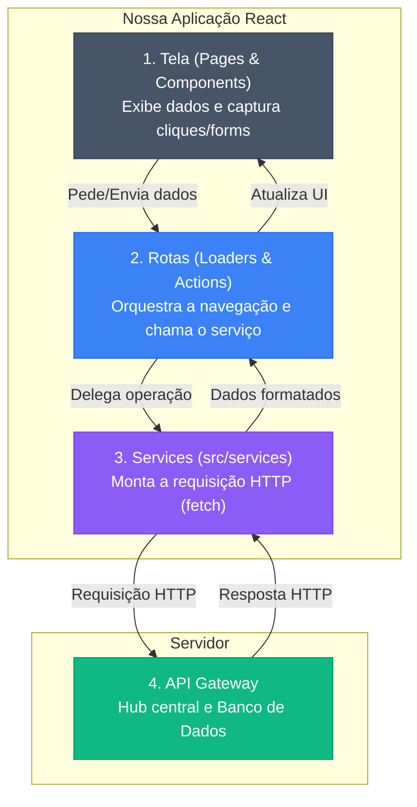

# Frontend - Arquitetura e Estrutura

Este documento explica como o frontend funciona, como as pastas estão organizadas e como os dados viajam entre a tela do usuário e o servidor.

## O Caminho dos Dados (O Fluxo Completo)

O sistema usa o React Router v7 para gerenciar o tráfego de dados. Nenhuma tela (componente visual) conversa diretamente com a API. Tudo obedece a uma hierarquia estrita de 3 passos no frontend antes de chegar ao servidor.

1. **Tela (UI):** Captura a ação do usuário (acessar uma página ou enviar um form).
2. **Rota (Loader/Action):** Intercepta a ação, mas delega o trabalho pesado.
3. **Serviço (Service):** Monta a requisição HTTP (headers, tokens, body) e fala com a API.



### O que isso significa na prática ?

- **Para ler (Loaders):** Quando o usuário acessa `insights`, o `loader` pede os dados, chamando o `serviceFeedbacks.ServiceGetFeedbackInsightsReport()`. O **Service** anexa o JWT, faz o GET no Gateway, trata possíveis erros HTTP e devolve o JSON limpo para o `loader`. O `loader` entrega para a tela via `useRouteLoaderData()`.

- **Para escrever (Actions):** O usuário preenche um `<Form>` e submete. A `action` extrai os dados do formulário e repassa para o `serviceEnterprise.ServiceUpdateCollectingDataEnterprise(dados)`. O **Service** faz o POST/PATCH. A `action` apenas recebe a confirmação e avisa a tela.

## As 4 Camadas do Sistema
Para manter o código fácil de dar manutenção, separamos as responsabilidades:

1. **Páginas (`pages/`)** — Arquivos que apenas juntam componentes para formar uma tela completa. Pegam os dados das rotas e repassam para os filhos. Sem lógica de negócio.

2. **Componentes (`components/`)** — Blocos visuais reaproveitáveis (botões, cards, gráficos). Recebem propriedades (props) e emitem eventos.

3. **Rotas (`src/routes/`)** — **Os Controladores:** Onde vivem Loaders e Actions. Eles conectam a tela ao motor de dados.

4. **Infraestrutura (`src/services/`)** — **O coração da comunicação**. Contém as funções que isolam todo o uso de `fetch`, URLs da API e injeção de tokens de autenticação.

## Onde Encontrar Cada Arquivo
```
apps/web/
├── src/
│   ├── routes/                 → Orquestradores (Loaders, Actions e a árvore de Rotas)
│   │   ├── actions/            → Funções de mutation (POST, PATCH, DELETE)
│   │   ├── loaders/            → Funções de leitura (GET), uma por rota
│   │   └── load/               → Helpers compartilhados chamados pelos loaders
│   ├── services/               → Serviços HTTP (onde as requisições são montadas)
│   │   ├── serviceAuth.ts
│   │   ├── serviceCollectionPoints.ts
│   │   ├── serviceEnterprise.ts
│   │   ├── serviceFeedbackQRCode.ts
│   │   ├── serviceFeedbacks.ts
│   │   └── serviceUser.ts
│   ├── supabase/               → Inicialização do client Supabase
│   └── lib/
│       ├── constants/          → Constantes de rotas e intents
│       ├── context/            → Contextos React (ex: insightsControls)
│       ├── mock/               → Dados mock para desenvolvimento
│       └── utils/              → Utilitários puros (formatação, validação, http)
├── pages/                      → Montagem das telas (composição de componentes)
│   ├── public/                 → Páginas públicas (home, login, register, qrcode)
│   └── user/                   → Páginas autenticadas (dashboard, profile, feedbacks…)
├── layouts/                    → Layouts base (público e autenticado)
├── components/
│   ├── fallbacks/              → Componentes de fallback de carregamento
│   ├── globals/                → Componentes globais (ex: errorPage)
│   ├── svg/                    → Ícones e imagens SVG inline
│   ├── public/                 → Componentes da área pública
│   │   ├── forms/              → Formulários (login, register, qrcode, forgot/reset password)
│   │   ├── layout/             → Header público
│   │   ├── qrcode/enterprise/  → Estados do formulário QR Code (loading, error, submitted…)
│   │   └── shared/             → Peças comuns da área pública
│   └── user/
│       ├── layout/             → Estrutura base autenticada (Menu, Sidebar, Header)
│       ├── shared/             → Peças comuns (Cards, Avatares, Skeletons, Badge)
│       └── pages/              → Peças específicas de cada tela
│           ├── dashboard/
│           ├── edit/
│           ├── feedbacks/
│           │   ├── analytics/
│           │   └── insights/
│           ├── feedbacksAll/
│           ├── feedbacksAnalyticsAll/
│           ├── feedbacksAnalyticsNegative/
│           ├── feedbacksAnalyticsPositive/
│           ├── feedbacksInsightsEmotional/
│           ├── feedbacksInsightsReport/
│           ├── feedbacksInsightsStatistics/
│           ├── profile/
│           ├── qrcodeCatalog/
│           ├── qrcodeEnterprise/
│           └── qrcodes/
└── styles/                     → Estilos globais
```

## Tipos de Entidade: `Enterprise` vs `EnterpriseContext`

O frontend usa dois tipos TypeScript distintos para representar a empresa — cada um com uma responsabilidade clara.

### `Enterprise` (em `shared/interfaces/entities/enterprise.entity.ts`)

Representa exatamente o que existe na tabela `public.enterprise` do banco de dados:

```typescript
interface Enterprise {
  id: string;
  document: string;
  account_type?: 'CPF' | 'CNPJ';
  terms_version?: string;
  terms_accepted_at?: string | null;
  created_at: string;
  trial_ends_at: string | null;
  subscription_status: 'TRIAL' | 'ACTIVE' | 'EXPIRED' | 'CANCELED';
}
```

### `EnterpriseContext` (mesmo arquivo, exportado como `type`)

É o tipo composto usado pelos componentes do dashboard — `Enterprise` mais os campos que vêm de `auth.users` (e são mesclados no loader):

```typescript
type EnterpriseContext = Enterprise & {
  full_name: string | null;
  email: string | null;
  phone: string | null;
};
```

### Por que essa separação?

`full_name`, `email` e `phone` não existem na tabela `enterprise` — eles vivem em `auth.users`. O loader `loadUserContext` faz o merge antes de entregar os dados para as rotas:

```typescript
const enterprise: EnterpriseContext = {
  ...enterprisePayload.enterprise,
  email: user.email ?? null,
  phone: user.phone ?? null,
  full_name: user.user_metadata?.full_name ?? null,
};
```

**Regra prática:** use `Enterprise` ao tipar dados que vêm diretamente da API/banco. Use `EnterpriseContext` em componentes de UI que precisam exibir nome, e-mail ou telefone do gestor junto com os dados da empresa.
