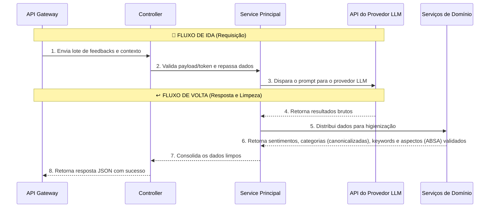

# IA Analyze — Arquitetura e Estrutura

Este documento detalha a arquitetura do serviço Serverless de IA (`ia-analyze`). Diferente do API Gateway, este serviço não possui conexão com o banco de dados. Sua única responsabilidade é processar textos de forma isolada, recebendo dados brutos e retornando análises estruturadas.

## O Fluxo de Dados (Ida e Volta)

O processamento ocorre de forma sequencial através das camadas do sistema, garantindo que os dados sejam validados, enviados para a IA e rigorosamente sanitizados antes de retornarem.

### Fluxo de Ida (Recebendo a requisição)
1. **Rotas (`routes/`):** Recebem o lote de feedbacks enviado pelo API Gateway e direcionam para o controlador.
2. **Controllers (`controllers/`):** Validam a autorização interna (garantindo que a requisição veio do Gateway) e a estrutura do payload recebido.
3. **Service Principal (`services/iaAnalyze.service.ts`):** Orquestra o processo. Combina os feedbacks com as regras e o contexto de negócio da empresa.
4. **Providers (`providers/gemini.provider.ts`):** Prepara o prompt final e chama o Google Gemini (SDK `@google/genai`, modelo `gemini-2.5-flash`). O provider é específico do Gemini: trocar de provedor exige alterar este arquivo — o serviço não é fornecedor-agnóstico.

### Fluxo de Volta (Processando a resposta)
5. O **Provider** recebe a resposta bruta da Inteligência Artificial (que está sujeita a "alucinações" ou fuga do formato).
6. O **Service Principal** recebe esses dados e os distribui para seus **Serviços de Domínio** especializados:
   - **Análise de Sentimento:** Valida se a classificação está estritamente entre Positivo, Neutro ou Negativo.
   - **Palavras-chave e Categorias:** Sanitiza os termos extraídos, garantindo que eles realmente existam no texto original do cliente. As categorias ainda são **canonicalizadas** contra a taxonomia fixa do escopo (`categorization.service` passou a receber `scopeType`), tornando-as comparáveis e tendenciáveis.
   - **Aspectos (ABSA):** Extrai os aspectos com sentimento por tópico (`aspectExtraction.service`), também ancorados no texto original. Além disso, o Service Principal grava o `sentiment_score` graduado (com fallback derivado da classe de sentimento) e a `confidence` de cada item.
   - **Contexto Global:** Consolida os insights daquele lote de forma coesa.
7. O **Service Principal** agrupa todas essas validações num pacote limpo e seguro, repassando ao **Controller**.
8. O **Controller** entrega a resposta final (em formato JSON padronizado) de volta ao API Gateway.

---

## O Fluxo Visual



---

## `termProcessing.ts` — Núcleo de Sanitização

Este módulo é o coração do processamento linguístico. Filtra termos que o modelo possa ter "alucinado", descartando os que não aparecem no feedback original.

### `sanitizeTermList`

```typescript
sanitizeTermList({
  terms: string[],            // lista bruta do modelo (keywords ou categorias)
  messageNormalized: string,  // mensagem do feedback normalizada
  forbiddenTerms: Set<string>,// termos que não devem aparecer
  maxCount: number,           // limite de termos no resultado
}) → string[]
```

Garante que cada termo:
1. É uma string não-vazia
2. Aparece de alguma forma na mensagem original (filtra alucinações)
3. Não está na lista de termos proibidos
4. Não é duplicata

### `buildForbiddenTerms`

Constrói o `Set` de termos proibidos a partir do feedback:
- Rótulos genéricos de respostas estruturadas (`STRUCTURED_ANSWER_LABELS`: `pessimo`, `ruim`, `mediana`, `boa`, `otima`)
- `answer_value` e `question_text_snapshot` de cada resposta dinâmica (`dynamic_answers`)
- `answer_value` e `subquestion_text_snapshot` de cada subresposta dinâmica (`dynamic_subanswers`)

### `tokenizeRelevantWords`

Quebra uma string em palavras relevantes removendo stop words e palavras com menos de 4 caracteres. Usado como **fallback de keywords** quando o modelo não retorna nenhuma keyword válida.

---

## `categoryTaxonomy.ts` — Taxonomia fixa por escopo

Torna as categorias **comparáveis e tendenciáveis**: a saída livre do modelo é mapeada para um rótulo canônico quando bate com o canônico ou um sinônimo; quando não bate, o termo é mantido como **emergente** (sem perda de sinal). Os rótulos canônicos seguem o estilo do saneamento (`normalizeForComparison`: minúsculas, sem acento), para casar na deduplicação.

- **`TAXONOMY_BY_SCOPE`:** tabela fixa de categorias (drivers de CX) por escopo `COMPANY` / `PRODUCT` / `SERVICE` / `DEPARTMENT`, cada nó com um `canonical` e seus `synonyms`. Semeada a partir das listas de `prompts/scopeInstructions.ts`.
- **`canonicalizeCategories(scope, categories)`:** mapeia cada categoria já saneada para a taxonomia — match exato (canônico/sinônimo) → canônico; senão, se algum **token** da categoria for chave → canônico; senão, mantém o termo como emergente (normalizado). Deduplica preservando a ordem.
- **`getTaxonomyLabels(scope)`:** retorna os rótulos canônicos do escopo, usados como **nudge** no prompt.

O `categorization.service` agora recebe `scopeType` e chama `canonicalizeCategories` sobre a lista saneada (ou sobre o fallback de keywords, quando vazia).

---

## `aspectExtraction.service.ts` — Aspectos (ABSA)

Extrai aspectos (Aspect-Based Sentiment Analysis) do que o modelo devolveu, reusando o mesmo saneamento de categorias/keywords.

- **`extractAspects(feedback, rawAspects)`:** cada rótulo precisa estar **ancorado no `message`**, não pode ser termo proibido (rótulos de pergunta/Likert), é **deduplicado** e limitado a no máximo **6** aspectos. Cada aspecto preserva seu `sentiment` (validado entre Positivo/Neutro/Negativo) e seu `sentiment_score` (com `clamp` em `[-1, 1]`). Retorna `[]` quando `rawAspects` não é um array.
- **Helpers:** `clampScore` (limita ao intervalo `[-1, 1]`; `undefined` se não for número válido), `normalizeConfidence` (limita a `[0, 1]`) e `scoreFromSentiment` (score padrão a partir da classe quando o modelo omite: `+0.6` / `0` / `-0.6`).

---

## Resiliência do Orquestrador (`iaAnalyze.service.ts`)

Como os lotes passaram a ser fatiados por tamanho no gateway, o número de chamadas ao Gemini cresce. O orquestrador foi endurecido em duas frentes:

- **Concorrência limitada:** `mapWithConcurrency` (semáforo simples que preserva a ordem dos resultados) substitui o `Promise.all` sem limite. O teto de chamadas em voo vem de `IA_GEMINI_CONCURRENCY` (default **3**), evitando estourar o rate limit do Gemini.
- **Sucesso PARCIAL por lote:** um lote que falha **não derruba os demais**. O serviço só propaga erro quando **todos** os lotes com conteúdo falham; nesse caso agrega os códigos de falha no log e relança `failed_ia_request` (se a primeira falha foi de requisição) ou `invalid_ai_response`. Se ao menos um lote dá certo, os que falharam ficam de fora e podem ser reprocessados numa próxima execução.

---

## Resiliência do Provider (`gemini.provider.ts`)

- **Retry/backoff exponencial com jitter:** até `MAX_ATTEMPTS = 4` tentativas para falhas transitórias (status `429`, `500`, `502`, `503`, `504`). O atraso é exponencial com jitter (limitado a 20s) e **honra o `retryDelay`** sugerido pelo Gemini quando presente. Falhas não-transitórias (`400`, `401`, `404`) não são retentadas.
- **Teto de saída:** `maxOutputTokens = 16384` por chamada — folgado, abaixo do máximo do modelo (65.536), servindo de trava já que os lotes vêm fatiados por tamanho.
- **Saída truncada:** quando o `finishReason` do candidato é `MAX_TOKENS`, o JSON está incompleto; o provider **não tenta parsear** e lança `invalid_ai_response`.

---

## Estrutura de Diretórios

```
services/ia-analyze/
├── src/
│   ├── index.ts                            → Entry point do servidor Express
│   ├── controllers/
│   │   └── iaAnalyze.controller.ts         → Token + payload + resposta HTTP
│   ├── services/
│   │   ├── iaAnalyze.service.ts            → Orquestrador principal
│   │   ├── sentimentAnalysis.service.ts    → Validação de sentimentos
│   │   ├── keywordExtraction.service.ts    → Extração com fallback
│   │   ├── categorization.service.ts       → Categorização com fallback + canonicalização por escopo
│   │   ├── aspectExtraction.service.ts     → Extração de aspectos (ABSA) ancorada no message
│   │   └── globalInsights.service.ts       → Contexto por batch
│   ├── providers/
│   │   └── gemini.provider.ts              → Cliente HTTP do provedor LLM + analyzeBatch
│   ├── routes/
│   │   └── iaAnalyze.routes.ts             → /health + /ia-analyze/analyze
│   ├── lib/
│   │   ├── iaAnalyzePromptBuilders.ts      → Construtores de prompt por escopo
│   │   ├── termProcessing.ts               → sanitize, forbidden terms, tokenize
│   │   ├── categoryTaxonomy.ts             → Taxonomia fixa por escopo + canonicalização
│   │   └── prompts/
│   │       ├── promptHeader.ts             → Cabeçalho base do prompt
│   │       └── scopeInstructions.ts        → Instruções por escopo injetadas no prompt
│   ├── validations/
│   │   └── iaAnalyze.validation.ts         → isValidRemotePayload
│   └── utils/
│       ├── extractJsonFromText.ts
│       ├── isInternalRequestAuthorized.ts
│       ├── isObject.ts
│       └── normalizeForComparison.ts
├── types/                                  → Tipos compartilhados (fora de src/)
│   ├── iaAnalyzeEngine.types.ts
│   ├── iaAnalyzePromptBuilders.types.ts
│   ├── iaApiClient.types.ts
│   ├── sentimentAnalysis.types.ts
│   └── termProcessing.types.ts
└── src/tests/
    ├── lib/
    │   ├── termProcessing.test.ts
    │   └── categoryTaxonomy.test.ts
    ├── routes/
    │   ├── analyze.test.ts
    │   └── health.test.ts
    └── services/
        ├── sentiment.test.ts
        └── aspectExtraction.test.ts
```

---

## Breaking Change — Reestruturação Completa

> ⚠️ **Aviso: Breaking Change (homolog → main)**
> 
> O serviço foi completamente reescrito nesta branch:
> 
> **Antes (main):** arquivo único `sentimentAnalysis.ts` de 40 linhas, sem estrutura de serviços.
> 
> **Depois (homolog):** 5 serviços separados, provider isolado, biblioteca de processamento de termos, rotas próprias com health check, validação separada e tipos em arquivos dedicados.
> 
> Qualquer integração que importe módulos internos do `ia-analyze` diretamente precisará ser atualizada para os novos caminhos.
