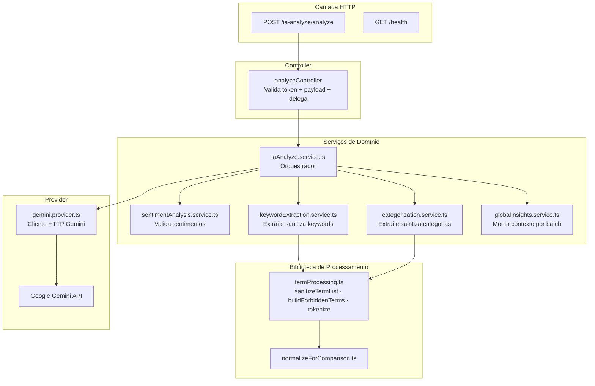
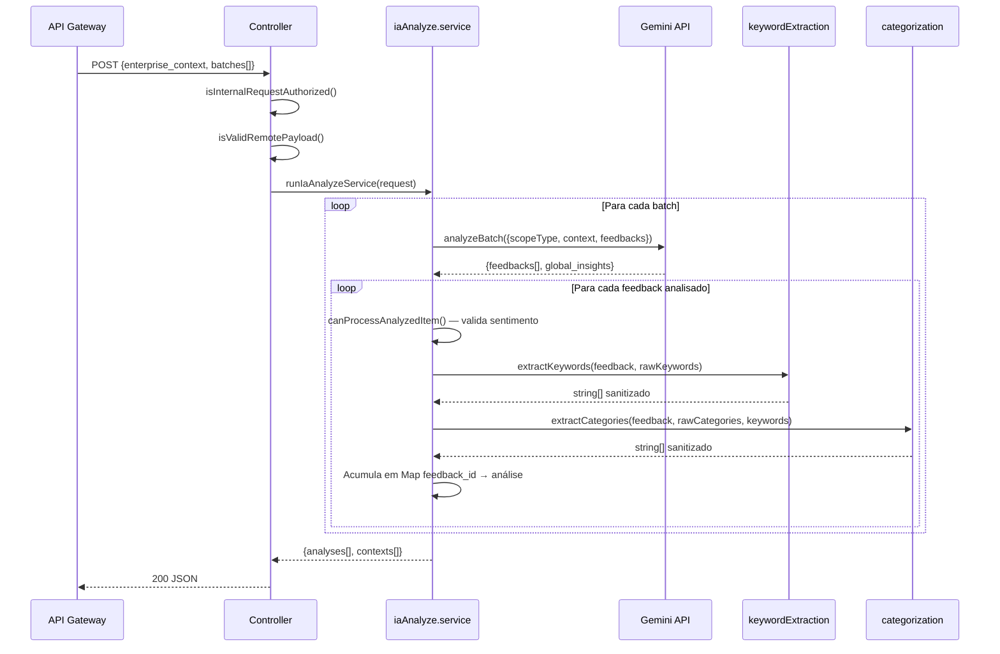

# IA Analyze — Arquitetura e Estrutura

## Organização em Camadas

O serviço segue uma arquitetura em camadas simples, sem acesso a banco de dados:

```
Route → Controller → Service (orquestrador) → Serviços de Domínio → Provider (Gemini)
```



---

## Fluxo de Processamento por Batch



---

## `termProcessing.ts` — Núcleo de Sanitização

Este módulo é o coração do processamento linguístico. Garante que o modelo não "alucine" termos que não existem no feedback original.

### `sanitizeTermList`

```typescript
sanitizeTermList({
  terms: string[],            // lista bruta do modelo (keywords ou categorias)
  messageNormalized: string,  // mensagem do feedback normalizada
  forbiddenTerms: Set<string>,// termos que não devem aparecer
  maxCount: number,           // limite de termos no resultado
}) → string[]
```

Garante que cada termo:
1. É uma string não-vazia
2. Aparece de alguma forma na mensagem original (filtra alucinações)
3. Não está na lista de termos proibidos
4. Não é duplicata

### `buildForbiddenTerms`

Constrói o `Set` de termos proibidos a partir do feedback:
- Tokens do nome da empresa
- Tokens do nome do item de catálogo
- Marcadores de sentimento em português (`positivo`, `negativo`, `neutro`, etc.)

### `tokenizeRelevantWords`

Quebra uma string em palavras relevantes removendo stop words e palavras com menos de 3 caracteres. Usado como **fallback de keywords** quando o modelo não retorna nenhuma keyword válida.

---

## Estrutura de Diretórios

```
services/ia-analyze/src/
├── controllers/
│   └── iaAnalyze.controller.ts         → Token + payload + resposta HTTP
├── services/
│   ├── iaAnalyze.service.ts            → Orquestrador principal
│   ├── sentimentAnalysis.service.ts    → Validação de sentimentos
│   ├── keywordExtraction.service.ts    → Extração com fallback
│   ├── categorization.service.ts       → Categorização com fallback
│   └── globalInsights.service.ts       → Contexto por batch
├── providers/
│   └── gemini.provider.ts              → Cliente HTTP Gemini + analyzeBatch
├── routes/
│   └── iaAnalyze.routes.ts             → /health + /ia-analyze/analyze
├── lib/
│   ├── termProcessing.ts               → sanitize, forbidden terms, tokenize
│   └── prompts/scopeInstructions.ts    → Instruções por escopo injetadas no prompt
├── validations/
│   └── iaAnalyze.validation.ts         → isValidRemotePayload
├── utils/
│   ├── extractJsonFromText.ts
│   ├── isInternalRequestAuthorized.ts
│   ├── isObject.ts
│   └── normalizeForComparison.ts
└── types/
    ├── sentimentAnalysis.types.ts
    └── termProcessing.types.ts
```

---

## Breaking Change — Reestruturação Completa

:::warning Breaking Change (homolog → main)
O serviço foi completamente reescrito nesta branch:

**Antes (main):** arquivo único `sentimentAnalysis.ts` de 40 linhas, sem estrutura de serviços.

**Depois (homolog):** 5 serviços separados, provider isolado, biblioteca de processamento de termos, rotas próprias com health check, validação separada e tipos em arquivos dedicados.

Qualquer integração que importe módulos internos do `ia-analyze` diretamente precisará ser atualizada para os novos caminhos.
:::
