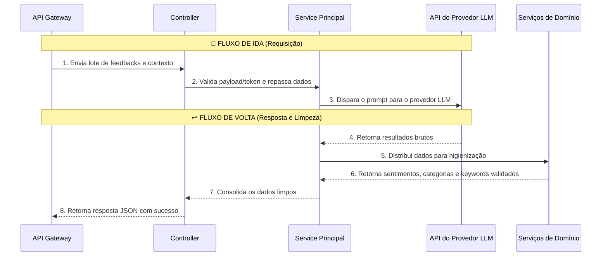

# IA Analyze — Arquitetura e Estrutura

Este documento detalha a arquitetura do serviço Serverless de IA (`ia-analyze`). Diferente do API Gateway, este serviço não possui conexão com o banco de dados. Sua única responsabilidade é processar textos de forma isolada, recebendo dados brutos e retornando análises estruturadas.

## O Fluxo de Dados (Ida e Volta)

O processamento ocorre de forma sequencial através das camadas do sistema, garantindo que os dados sejam validados, enviados para a IA e rigorosamente sanitizados antes de retornarem.

### Fluxo de Ida (Recebendo a requisição)
1. **Rotas (`routes/`):** Recebem o lote de feedbacks enviado pelo API Gateway e direcionam para o controlador.
2. **Controllers (`controllers/`):** Validam a autorização interna (garantindo que a requisição veio do Gateway) e a estrutura do payload recebido.
3. **Service Principal (`services/iaAnalyze.service.ts`):** Orquestra o processo. Combina os feedbacks com as regras e o contexto de negócio da empresa.
4. **Providers (`providers/gemini.provider.ts`):** Prepara o prompt final e realiza a chamada HTTP para a API do provedor LLM externo.

### Fluxo de Volta (Processando a resposta)
5. O **Provider** recebe a resposta bruta da Inteligência Artificial (que está sujeita a "alucinações" ou fuga do formato).
6. O **Service Principal** recebe esses dados e os distribui para seus **Serviços de Domínio** especializados:
   - **Análise de Sentimento:** Valida se a classificação está estritamente entre Positivo, Neutro ou Negativo.
   - **Palavras-chave e Categorias:** Sanitiza os termos extraídos, garantindo que eles realmente existam no texto original do cliente.
   - **Contexto Global:** Consolida os insights daquele lote de forma coesa.
7. O **Service Principal** agrupa todas essas validações num pacote limpo e seguro, repassando ao **Controller**.
8. O **Controller** entrega a resposta final (em formato JSON padronizado) de volta ao API Gateway.

---

## O Fluxo Visual



---

## `termProcessing.ts` — Núcleo de Sanitização

Este módulo é o coração do processamento linguístico. Garante que o modelo não "alucine" termos que não existem no feedback original.

### `sanitizeTermList`

```typescript
sanitizeTermList({
  terms: string[],            // lista bruta do modelo (keywords ou categorias)
  messageNormalized: string,  // mensagem do feedback normalizada
  forbiddenTerms: Set<string>,// termos que não devem aparecer
  maxCount: number,           // limite de termos no resultado
}) → string[]
```

Garante que cada termo:
1. É uma string não-vazia
2. Aparece de alguma forma na mensagem original (filtra alucinações)
3. Não está na lista de termos proibidos
4. Não é duplicata

### `buildForbiddenTerms`

Constrói o `Set` de termos proibidos a partir do feedback:
- Tokens do nome da empresa
- Tokens do nome do item de catálogo
- Marcadores de sentimento em português (`positivo`, `negativo`, `neutro`, etc.)

### `tokenizeRelevantWords`

Quebra uma string em palavras relevantes removendo stop words e palavras com menos de 3 caracteres. Usado como **fallback de keywords** quando o modelo não retorna nenhuma keyword válida.

---

## Estrutura de Diretórios

```
services/ia-analyze/
├── src/
│   ├── index.ts                            → Entry point do servidor Express
│   ├── controllers/
│   │   └── iaAnalyze.controller.ts         → Token + payload + resposta HTTP
│   ├── services/
│   │   ├── iaAnalyze.service.ts            → Orquestrador principal
│   │   ├── sentimentAnalysis.service.ts    → Validação de sentimentos
│   │   ├── keywordExtraction.service.ts    → Extração com fallback
│   │   ├── categorization.service.ts       → Categorização com fallback
│   │   └── globalInsights.service.ts       → Contexto por batch
│   ├── providers/
│   │   └── gemini.provider.ts              → Cliente HTTP do provedor LLM + analyzeBatch
│   ├── routes/
│   │   └── iaAnalyze.routes.ts             → /health + /ia-analyze/analyze
│   ├── lib/
│   │   ├── iaAnalyzePromptBuilders.ts      → Construtores de prompt por escopo
│   │   ├── termProcessing.ts               → sanitize, forbidden terms, tokenize
│   │   └── prompts/
│   │       ├── promptHeader.ts             → Cabeçalho base do prompt
│   │       └── scopeInstructions.ts        → Instruções por escopo injetadas no prompt
│   ├── validations/
│   │   └── iaAnalyze.validation.ts         → isValidRemotePayload
│   └── utils/
│       ├── extractJsonFromText.ts
│       ├── isInternalRequestAuthorized.ts
│       ├── isObject.ts
│       └── normalizeForComparison.ts
├── types/                                  → Tipos compartilhados (fora de src/)
│   ├── iaAnalyzeEngine.types.ts
│   ├── iaAnalyzePromptBuilders.types.ts
│   ├── iaApiClient.types.ts
│   ├── sentimentAnalysis.types.ts
│   └── termProcessing.types.ts
└── __tests__/
    ├── iaAnalyzePromptBuilders.test.ts
    └── sentimentAnalysis.test.ts
```

---

## Breaking Change — Reestruturação Completa

> ⚠️ **Aviso: Breaking Change (homolog → main)**
> 
> O serviço foi completamente reescrito nesta branch:
> 
> **Antes (main):** arquivo único `sentimentAnalysis.ts` de 40 linhas, sem estrutura de serviços.
> 
> **Depois (homolog):** 5 serviços separados, provider isolado, biblioteca de processamento de termos, rotas próprias com health check, validação separada e tipos em arquivos dedicados.
> 
> Qualquer integração que importe módulos internos do `ia-analyze` diretamente precisará ser atualizada para os novos caminhos.
